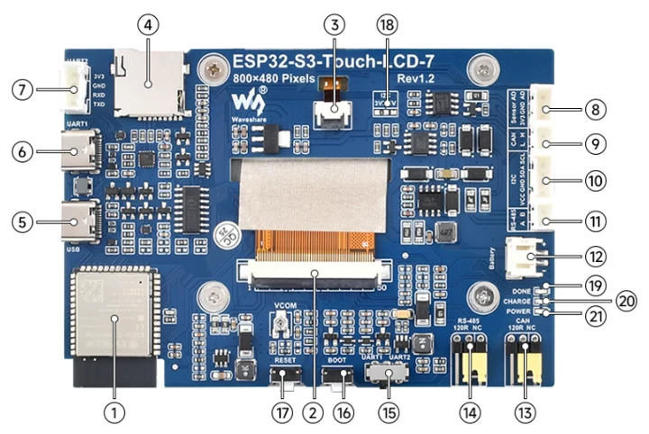
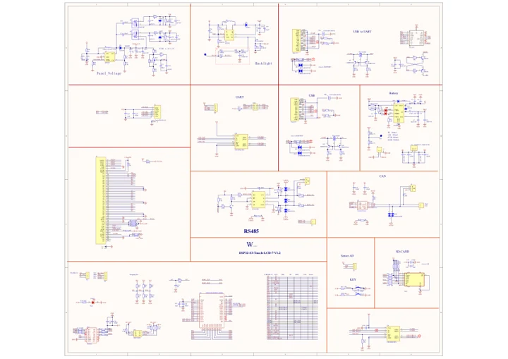

# ESP32-S3-Touch-LCD-7

**Waveshare** · ESP32-S3

Revision: Not identified

Coverage: Manufacturer references reviewed by scope; independent electrical and all-connector review pending

[Browse all manufacturers](../../../../BROWSE.md) · [Devices & IoT](../../../../DEVICES.md) · [Open in the browser guide](https://valleytech-black-wire-guide.pages.dev/?board=waveshare-esp32-esp32-s3-touch-lcd-7)

## Datasheets and original documentation

Board datasheet: **not yet recorded**. Visual reference: **available**.

[Manufacturer hardware documentation](https://www.waveshare.com/wiki/ESP32-S3-Touch-LCD-7)

- **schematic / recorded-source**: [Schematic](https://files.waveshare.com/wiki/ESP32-S3-Touch-LCD-7/ESP32-S3-Touch-LCD-7-Sch.pdf) · [saved document](../../../../library/media/025bbbdf2c5aea16e485d02736d2c954e8757f3418c193372d932316ab3ae164.pdf)
- **hardware-guide / board**: [Manufacturer pin and hardware documentation](https://www.waveshare.com/wiki/ESP32-S3-Touch-LCD-7) · online

A chip datasheet, schematic and board datasheet have different scopes. Match the exact hardware revision.

[Documentation coverage and remaining gaps](../../../../DOCUMENTATION.md)

## Onboard Resources

**board labeling image** · Source identity and visual scope inspected; PDF review covers first-page preview. Independent electrical and all-connector completeness review pending. · PNG

[Open original reference](../../../../library/media/8a9e6693786912c380ced6a3e70b37093611714fecc61a0fbfdd1405bc9f3e30.png)

**Credit and rights:** Manufacturer artwork; reuse and print rights not established. Inclusion does not relicense the original.. Source/manufacturer: Waveshare.

[Source 1](https://www.waveshare.com/w/upload/b/b3/ESP32-S3-LCD-7-02.png) · [Source 2](https://www.waveshare.com/wiki/ESP32-S3-Touch-LCD-7)

Manufacturer source retained unchanged. Source identity and visual scope inspected; PDF review covers first-page preview. Independent electrical and all-connector completeness review pending. See the linked manufacturer page for the numbered component legend. This is not a complete physical pinout.

Image revision: As supplied in the original; match exact board revision

SHA-256: `8a9e6693786912c380ced6a3e70b37093611714fecc61a0fbfdd1405bc9f3e30`

## Schematic

**original reference PDF** · Source identity and visual scope inspected; PDF review covers first-page preview. Independent electrical and all-connector completeness review pending. · PDF

[Open original reference](../../../../library/media/025bbbdf2c5aea16e485d02736d2c954e8757f3418c193372d932316ab3ae164.pdf)

**Credit and rights:** Manufacturer artwork; reuse and print rights not established. Inclusion does not relicense the original.. Source/manufacturer: Waveshare.

[Source 1](https://files.waveshare.com/wiki/ESP32-S3-Touch-LCD-7/ESP32-S3-Touch-LCD-7-Sch.pdf) · [Source 2](https://www.waveshare.com/wiki/ESP32-S3-Touch-LCD-7)

Manufacturer source retained unchanged. Source identity and visual scope inspected; PDF review covers first-page preview. Independent electrical and all-connector completeness review pending.

Image revision: As supplied in the original; match exact board revision

SHA-256: `025bbbdf2c5aea16e485d02736d2c954e8757f3418c193372d932316ab3ae164`

Pin assignments have not been independently electrically verified. Check board revision before wiring.
