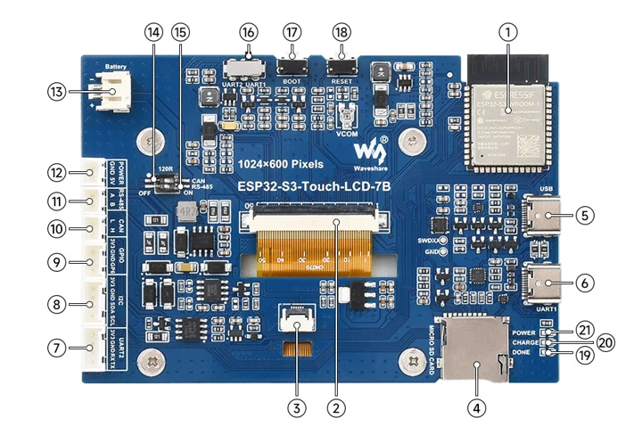
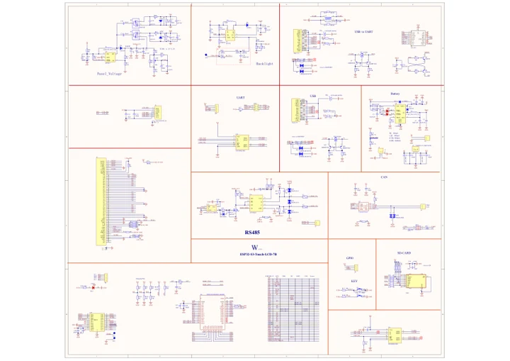

# ESP32-S3-Touch-LCD-7B

**Waveshare** · ESP32-S3

Revision: Not identified

Coverage: Manufacturer references reviewed by scope; independent electrical and all-connector review pending

[Browse all manufacturers](../../../../BROWSE.md) · [Devices & IoT](../../../../DEVICES.md) · [Open in the browser guide](https://valleytech-black-wire-guide.pages.dev/?board=waveshare-esp32-esp32-s3-touch-lcd-7b)

## Datasheets and original documentation

Board datasheet: **not yet recorded**. Visual reference: **available**.

[Manufacturer hardware documentation](https://www.waveshare.com/wiki/ESP32-S3-Touch-LCD-7B)

- **schematic / board**: [ESP32-S3-Touch-LCD-7B Schematic diagram](https://files.waveshare.com/wiki/ESP32-S3-Touch-LCD-7B/ESP32-S3-Touch-LCD-7B-Schematic.pdf) · [saved document](../../../../library/media/60d31638254809aa39af0c5cc774ae4d2ebb73bdc4e57f68593cc4f559dec76c.pdf)
- **hardware-guide / board**: [Manufacturer pin and hardware documentation](https://www.waveshare.com/wiki/ESP32-S3-Touch-LCD-7B) · online

A chip datasheet, schematic and board datasheet have different scopes. Match the exact hardware revision.

[Documentation coverage and remaining gaps](../../../../DOCUMENTATION.md)

## Onboard Resources

**board labeling image** · Source identity and visual scope inspected; PDF review covers first-page preview. Independent electrical and all-connector completeness review pending. · JPG

[Open original reference](../../../../library/media/474030421ea7121c4f0359db437f16bb37af432e6410c15f3779a1891f93c5e6.jpg)

**Credit and rights:** Manufacturer artwork; reuse and print rights not established. Inclusion does not relicense the original.. Source/manufacturer: Waveshare.

[Source 1](https://www.waveshare.com/w/upload/b/b1/ESP32-S3-Touch-LCD-7B-details-intro.jpg) · [Source 2](https://www.waveshare.com/wiki/ESP32-S3-Touch-LCD-7B)

Manufacturer source retained unchanged. Source identity and visual scope inspected; PDF review covers first-page preview. Independent electrical and all-connector completeness review pending. See the linked manufacturer page for the numbered component legend. This is not a complete physical pinout.

Image revision: As supplied in the original; match exact board revision

SHA-256: `474030421ea7121c4f0359db437f16bb37af432e6410c15f3779a1891f93c5e6`

## ESP32-S3-Touch-LCD-7B Schematic diagram

**original reference PDF** · Source identity and visual scope inspected; PDF review covers first-page preview. Independent electrical and all-connector completeness review pending. · PDF

[Open original reference](../../../../library/media/60d31638254809aa39af0c5cc774ae4d2ebb73bdc4e57f68593cc4f559dec76c.pdf)

**Credit and rights:** Manufacturer artwork; reuse and print rights not established. Inclusion does not relicense the original.. Source/manufacturer: Waveshare.

[Source 1](https://files.waveshare.com/wiki/ESP32-S3-Touch-LCD-7B/ESP32-S3-Touch-LCD-7B-Schematic.pdf) · [Source 2](https://www.waveshare.com/wiki/ESP32-S3-Touch-LCD-7B)

Manufacturer source retained unchanged. Source identity and visual scope inspected; PDF review covers first-page preview. Independent electrical and all-connector completeness review pending.

Image revision: As supplied in the original; match exact board revision

SHA-256: `60d31638254809aa39af0c5cc774ae4d2ebb73bdc4e57f68593cc4f559dec76c`

Pin assignments have not been independently electrically verified. Check board revision before wiring.
