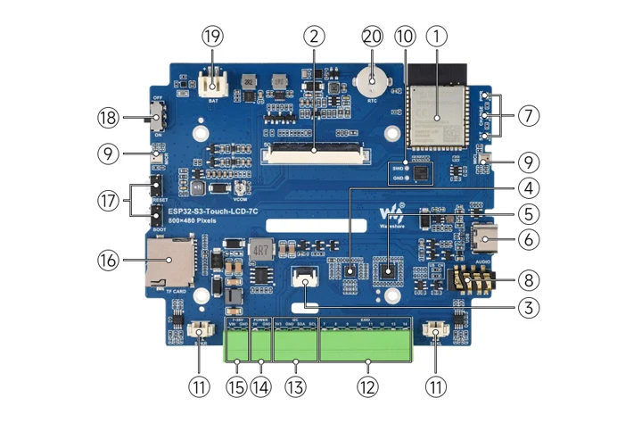
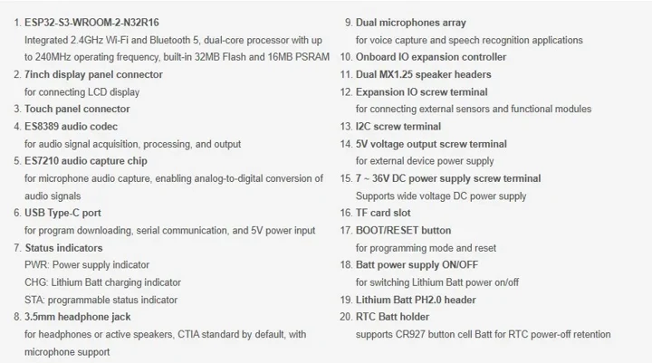
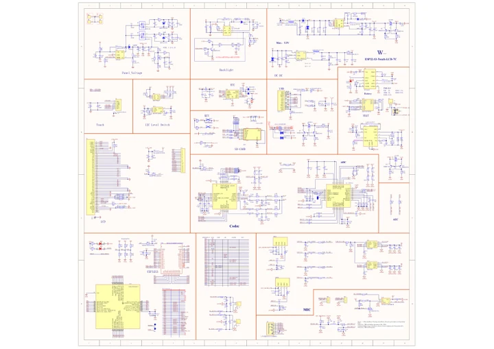

# ESP32-S3-Touch-LCD-7C-BOX

**Waveshare** · ESP32-S3

Revision: Not identified

Coverage: Manufacturer references reviewed by scope; independent electrical and all-connector review pending

[Browse all manufacturers](../../../../BROWSE.md) · [Devices & IoT](../../../../DEVICES.md) · [Open in the browser guide](https://valleytech-black-wire-guide.pages.dev/?board=waveshare-esp32-esp32-s3-touch-lcd-7c-box)

## Datasheets and original documentation

Board datasheet: **not yet recorded**. Visual reference: **available**.

[Manufacturer hardware documentation](https://docs.waveshare.com/ESP32-S3-Touch-LCD-7C-BOX)

- **schematic / recorded-source**: [ESP32-S3-Touch-LCD-7C Schematic (GitHub)](https://github.com/waveshareteam/ESP32-S3-Touch-LCD-7C/raw/main/schematic/ESP32-S3-Touch-LCD-7C-schematic.pdf) · [saved document](../../../../library/media/a5caef3d99b952662e8e1cf57f5c90f429085507e0d595a8a6d1e1c3f0cd17fb.pdf)
- **hardware-guide / board**: [Manufacturer pin and hardware documentation](https://docs.waveshare.com/ESP32-S3-Touch-LCD-7C-BOX) · online

A chip datasheet, schematic and board datasheet have different scopes. Match the exact hardware revision.

[Documentation coverage and remaining gaps](../../../../DOCUMENTATION.md)

## Onboard Resources ​

**board labeling image** · Source identity and visual scope inspected; PDF review covers first-page preview. Independent electrical and all-connector completeness review pending. · JPG

[Open original reference](../../../../library/media/74f5ea5048d2864a45220425172c49cca2fdf3aab2083bf546294ea93ed0a5eb.jpg)

**Credit and rights:** Manufacturer artwork; reuse and print rights not established. Inclusion does not relicense the original.. Source/manufacturer: Waveshare.

[Source 1](https://docs.waveshare.com/assets/images/ESP32-S3-Touch-LCD-7C-Source-01-1c5940fba937dfe1ca475a1fdd9fc3e8.webp) · [Source 2](https://docs.waveshare.com/ESP32-S3-Touch-LCD-7C-BOX)

Manufacturer source retained unchanged. Source identity and visual scope inspected; PDF review covers first-page preview. Independent electrical and all-connector completeness review pending. See the linked manufacturer page for the numbered component legend. This is not a complete physical pinout.

Image revision: As supplied in the original; match exact board revision

SHA-256: `74f5ea5048d2864a45220425172c49cca2fdf3aab2083bf546294ea93ed0a5eb`

## Onboard Resources ​

**board labeling image** · Source identity and visual scope inspected; PDF review covers first-page preview. Independent electrical and all-connector completeness review pending. · WEBP

[Open original reference](../../../../library/media/b3d2596fca3f298829bffe601701f661be7e92a1f58ba847cd1763445468a785.webp)

**Credit and rights:** Manufacturer artwork; reuse and print rights not established. Inclusion does not relicense the original.. Source/manufacturer: Waveshare.

[Source 1](https://docs.waveshare.com/assets/images/ESP32-S3-Touch-LCD-7C-Source-02-8f495c8d1819f7802a1a19dc6c37502b.webp) · [Source 2](https://docs.waveshare.com/ESP32-S3-Touch-LCD-7C-BOX)

Manufacturer source retained unchanged. Source identity and visual scope inspected; PDF review covers first-page preview. Independent electrical and all-connector completeness review pending. See the linked manufacturer page for the numbered component legend. This is not a complete physical pinout.

Image revision: As supplied in the original; match exact board revision

SHA-256: `b3d2596fca3f298829bffe601701f661be7e92a1f58ba847cd1763445468a785`

## ESP32-S3-Touch-LCD-7C Schematic (GitHub)

**original reference PDF** · Source identity and visual scope inspected; PDF review covers first-page preview. Independent electrical and all-connector completeness review pending. · PDF

[Open original reference](../../../../library/media/a5caef3d99b952662e8e1cf57f5c90f429085507e0d595a8a6d1e1c3f0cd17fb.pdf)

**Credit and rights:** Manufacturer artwork; reuse and print rights not established. Inclusion does not relicense the original.. Source/manufacturer: Waveshare.

[Source 1](https://github.com/waveshareteam/ESP32-S3-Touch-LCD-7C/raw/main/schematic/ESP32-S3-Touch-LCD-7C-schematic.pdf) · [Source 2](https://docs.waveshare.com/ESP32-S3-Touch-LCD-7C-BOX/Resources-And-Documents)

Manufacturer source retained unchanged. Source identity and visual scope inspected; PDF review covers first-page preview. Independent electrical and all-connector completeness review pending.

Image revision: As supplied in the original; match exact board revision

SHA-256: `a5caef3d99b952662e8e1cf57f5c90f429085507e0d595a8a6d1e1c3f0cd17fb`

Pin assignments have not been independently electrically verified. Check board revision before wiring.
