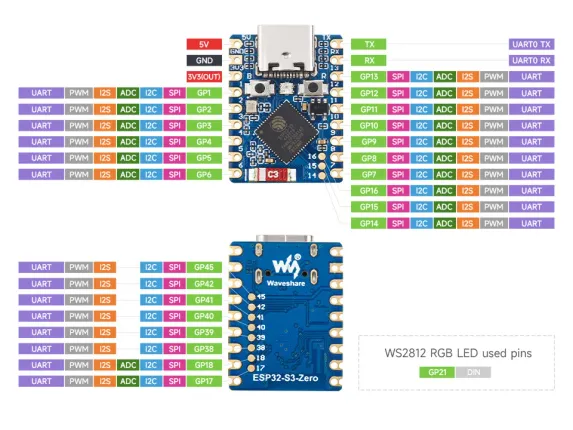
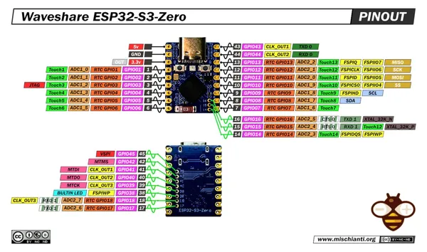

# ESP32-S3-Zero

**Waveshare** · ESP32-S3

Revision: Not identified  
Coverage: Pinout image collected

[Browse all manufacturers](../../../../BROWSE.md) · [Desktop app](https://github.com/valleytechsolutions/black-wire-desktop)

## Pinout

**pinout image** · Reviewed source · JPG

[Open original reference](../../../../library/media/613767333bbc154450d320508ce03e438f2ef8aa239afa22dc3d4458b873e8a7.jpg)

**Credit and rights:** Not recorded; retain original attribution. Source/manufacturer: Waveshare.

[Source 1](https://www.waveshare.com/img/devkit/ESP32-S3-Zero/ESP32-S3-Zero-details-inter.jpg) · [Source 2](https://www.waveshare.com/esp32-s3-zero.htm)

SHA-256: `613767333bbc154450d320508ce03e438f2ef8aa239afa22dc3d4458b873e8a7`

## Pinout

**pinout image** · Reviewed source · WEBP

[Open original reference](../../../../library/media/0df7f252e55d66721df03cd248f02cec854ba2e6f04af637d33372fa570a1947.webp)

**Credit and rights:** Not recorded; retain original attribution. Source/manufacturer: Waveshare.

[Source 1](https://docs.waveshare.com/assets/images/ESP32-S3-Zero-Pinout-10a4868b32f9da9005e87b2d9d84574e.webp) · [Source 2](https://docs.waveshare.com/ESP32-S3-Zero)

SHA-256: `0df7f252e55d66721df03cd248f02cec854ba2e6f04af637d33372fa570a1947`

## Pinout

**pinout image** · Reviewed source · JPG

[Open original reference](../../../../library/media/ba5ad1b550198324fecb00337401689d40f69b9f84ae3d0fbab69d58e2fcfc43.jpg)

**Credit and rights:** Not recorded; retain original attribution. Source/manufacturer: Waveshare.

[Source 1](https://www.waveshare.com/w/upload/8/87/ESP32-S3-Zero-details-inter.jpg) · [Source 2](https://www.waveshare.com/wiki/ESP32-S3-Zero)

SHA-256: `ba5ad1b550198324fecb00337401689d40f69b9f84ae3d0fbab69d58e2fcfc43`

## Pinout - Renzo Mischianti

**pinout image** · Reviewed source · JPG

[Open original reference](../../../../library/media/a66daef7d28692a96d32700f2abed5122298c2788b79474c7fd975187b015092.jpg)

**Credit and rights:** CC BY-NC-ND marking visible on image; exact license version and publication permissions not established. Source/manufacturer: Waveshare.

[Source 1](https://mischianti.org/wp-content/uploads/2025/07/esp32-S3-Zero-Waveshare-pinout-low.jpg) · [Source 2](https://mischianti.org/waveshare-esp32-s3-zero-high-resolution-datasheet-pinout-and-specs/)

Original public image by Renzo Mischianti, unchanged. Diagram/model matching is visual, not electrical verification. Exact PCB layout and revision must match; no inference of compatibility with lookalike marketplace clones.

SHA-256: `a66daef7d28692a96d32700f2abed5122298c2788b79474c7fd975187b015092`

Pin assignments have not been independently electrically verified. Check board revision before wiring.
