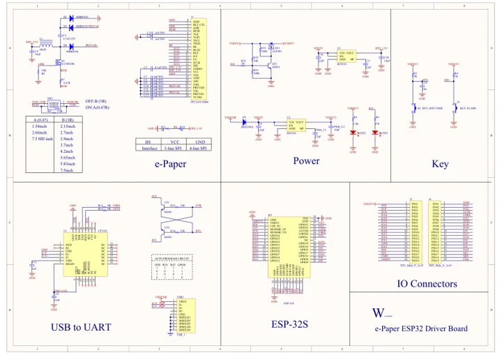
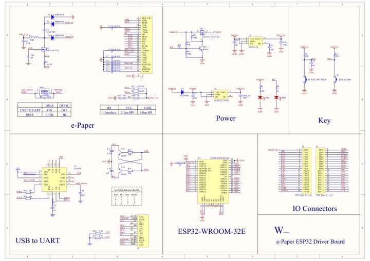

# E-Paper ESP32 Driver Board

**Waveshare** · ESP32

Revision: Not identified

Coverage: Manufacturer references reviewed by scope; independent electrical and all-connector review pending

[Browse all manufacturers](../../../../BROWSE.md) · [Devices & IoT](../../../../DEVICES.md) · [Open in the browser guide](https://valleytech-black-wire-guide.pages.dev/?board=waveshare-esp32-e-paper-esp32-driver-board)

## Datasheets and original documentation

Board datasheet: **not yet recorded**. Visual reference: **available**.

[Manufacturer hardware documentation](https://www.waveshare.com/wiki/E-Paper_ESP32_Driver_Board)

- **schematic / recorded-source**: [Schematic](https://files.waveshare.com/upload/8/80/E-Paper_ESP32_Driver_Board_Schematic.pdf) · [saved document](../../../../library/media/f5785063000efeeda229e9741ebc4e7e53b75fb3df66af98829029eba88880d2.pdf)
- **schematic / board**: [E-Paper ESP32 Driver Board V3 Schematic (current version)](https://files.waveshare.com/wiki/E-Paper-ESP32-Driver-Board/E-Paper_ESP32_Driver_Board_V3.pdf) · [saved document](../../../../library/media/6f3270b5287f25af54ceff7a3839daa8fc7419c04f0815ac05af17744098e4a2.pdf)
- **hardware-guide / board**: [Manufacturer pin and hardware documentation](https://www.waveshare.com/wiki/E-Paper_ESP32_Driver_Board) · online

A chip datasheet, schematic and board datasheet have different scopes. Match the exact hardware revision.

[Documentation coverage and remaining gaps](../../../../DOCUMENTATION.md)

## Schematic

**original reference PDF** · Source identity and visual scope inspected; PDF review covers first-page preview. Independent electrical and all-connector completeness review pending. · PDF

[Open original reference](../../../../library/media/f5785063000efeeda229e9741ebc4e7e53b75fb3df66af98829029eba88880d2.pdf)

**Credit and rights:** Manufacturer artwork; reuse and print rights not established. Inclusion does not relicense the original.. Source/manufacturer: Waveshare.

[Source 1](https://files.waveshare.com/upload/8/80/E-Paper_ESP32_Driver_Board_Schematic.pdf) · [Source 2](https://www.waveshare.com/wiki/E-Paper_ESP32_Driver_Board)

Manufacturer source retained unchanged. Source identity and visual scope inspected; PDF review covers first-page preview. Independent electrical and all-connector completeness review pending.

Image revision: As supplied in the original; match exact board revision

SHA-256: `f5785063000efeeda229e9741ebc4e7e53b75fb3df66af98829029eba88880d2`

## E-Paper ESP32 Driver Board V3 Schematic (current version)

**original reference PDF** · Source identity and visual scope inspected; PDF review covers first-page preview. Independent electrical and all-connector completeness review pending. · PDF

[Open original reference](../../../../library/media/6f3270b5287f25af54ceff7a3839daa8fc7419c04f0815ac05af17744098e4a2.pdf)

**Credit and rights:** Manufacturer artwork; reuse and print rights not established. Inclusion does not relicense the original.. Source/manufacturer: Waveshare.

[Source 1](https://files.waveshare.com/wiki/E-Paper-ESP32-Driver-Board/E-Paper_ESP32_Driver_Board_V3.pdf) · [Source 2](https://www.waveshare.com/wiki/E-Paper_ESP32_Driver_Board)

Manufacturer source retained unchanged. Source identity and visual scope inspected; PDF review covers first-page preview. Independent electrical and all-connector completeness review pending.

Image revision: As supplied in the original; match exact board revision

SHA-256: `6f3270b5287f25af54ceff7a3839daa8fc7419c04f0815ac05af17744098e4a2`

Pin assignments have not been independently electrically verified. Check board revision before wiring.
