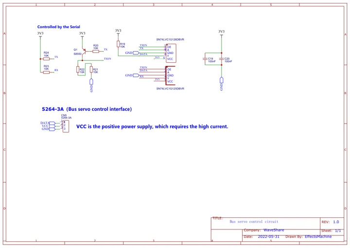
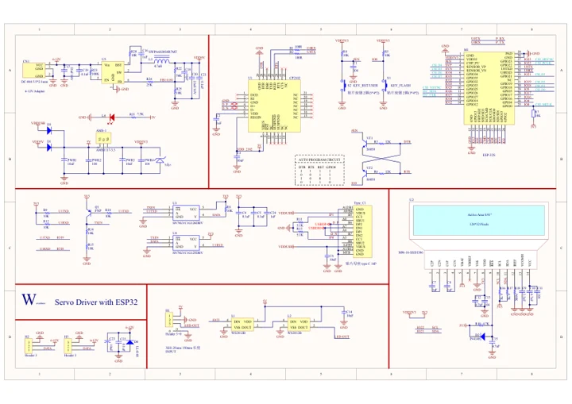

# Servo Driver with ESP32

**Waveshare** · ESP32

Revision: Not identified

Coverage: Manufacturer references reviewed by scope; independent electrical and all-connector review pending

[Browse all manufacturers](../../../../BROWSE.md) · [Devices & IoT](../../../../DEVICES.md) · [Open in the browser guide](https://valleytech-black-wire-guide.pages.dev/?board=waveshare-esp32-servo-driver-with-esp32)

## Datasheets and original documentation

Board datasheet: **not yet recorded**. Visual reference: **available**.

[Manufacturer hardware documentation](https://www.waveshare.com/wiki/Servo_Driver_with_ESP32)

- **schematic / recorded-source**: [Bus servo control circuit schematic](https://files.waveshare.com/upload/d/d3/Bus_servo_control_circuit.pdf) · [saved document](../../../../library/media/2d732e7bbaa7fb0ca70da324030b41f50ec39033dba2cfa35234e2be323bcbf4.pdf)
- **schematic / recorded-source**: [Development board schematic](https://files.waveshare.com/wiki/Servo-Driver-with-ESP32/Servo_Driver_with_ESP32.pdf) · [saved document](../../../../library/media/5c40860cdcc3a2e2ff0ee456fd5f6c3c84b925fc59c620ca910fb24e8b1d7ff5.pdf)
- **hardware-guide / board**: [Manufacturer pin and hardware documentation](https://www.waveshare.com/wiki/Servo_Driver_with_ESP32) · online

A chip datasheet, schematic and board datasheet have different scopes. Match the exact hardware revision.

[Documentation coverage and remaining gaps](../../../../DOCUMENTATION.md)

## Bus servo control circuit schematic

**original reference PDF** · Source identity and visual scope inspected; PDF review covers first-page preview. Independent electrical and all-connector completeness review pending. · PDF

[Open original reference](../../../../library/media/2d732e7bbaa7fb0ca70da324030b41f50ec39033dba2cfa35234e2be323bcbf4.pdf)

**Credit and rights:** Manufacturer artwork; reuse and print rights not established. Inclusion does not relicense the original.. Source/manufacturer: Waveshare.

[Source 1](https://files.waveshare.com/upload/d/d3/Bus_servo_control_circuit.pdf) · [Source 2](https://www.waveshare.com/wiki/Servo_Driver_with_ESP32)

Manufacturer source retained unchanged. Source identity and visual scope inspected; PDF review covers first-page preview. Independent electrical and all-connector completeness review pending.

Image revision: As supplied in the original; match exact board revision

SHA-256: `2d732e7bbaa7fb0ca70da324030b41f50ec39033dba2cfa35234e2be323bcbf4`

## Development board schematic

**original reference PDF** · Source identity and visual scope inspected; PDF review covers first-page preview. Independent electrical and all-connector completeness review pending. · PDF

[Open original reference](../../../../library/media/5c40860cdcc3a2e2ff0ee456fd5f6c3c84b925fc59c620ca910fb24e8b1d7ff5.pdf)

**Credit and rights:** Manufacturer artwork; reuse and print rights not established. Inclusion does not relicense the original.. Source/manufacturer: Waveshare.

[Source 1](https://files.waveshare.com/wiki/Servo-Driver-with-ESP32/Servo_Driver_with_ESP32.pdf) · [Source 2](https://www.waveshare.com/wiki/Servo_Driver_with_ESP32)

Manufacturer source retained unchanged. Source identity and visual scope inspected; PDF review covers first-page preview. Independent electrical and all-connector completeness review pending.

Image revision: As supplied in the original; match exact board revision

SHA-256: `5c40860cdcc3a2e2ff0ee456fd5f6c3c84b925fc59c620ca910fb24e8b1d7ff5`

Pin assignments have not been independently electrically verified. Check board revision before wiring.
