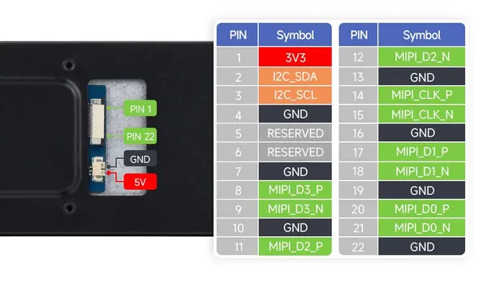

# 8.8-DSI-TOUCH-A

**Waveshare** · Expansion

Revision: Not identified

Coverage: Partial pinout collected; full reference still needed

[Browse all manufacturers](../../../../BROWSE.md) · [Devices & IoT](../../../../DEVICES.md) · [Open in the browser guide](https://valleytech-black-wire-guide.pages.dev/?board=waveshare-expansion-8-8-dsi-touch-a)

## Datasheets and original documentation

Board datasheet: **not yet recorded**. Visual reference: **available**.

Original manufacturer website still needs identification.

A chip datasheet, schematic and board datasheet have different scopes. Match the exact hardware revision.

[Documentation coverage and remaining gaps](../../../../DOCUMENTATION.md)

## Pinout - Spotpear source

**pinout image** · Reviewed source · JPG

[Open original reference](../../../../library/media/e27978f75331c64afe4e66ed316955c3972a77a16b10247021be36c4b4f61607.jpg)

**Credit and rights:** Not established; source attribution retained. Source/manufacturer: Waveshare.

[Source 1](https://cdn.static.spotpear.com/uploads/picture/product/raspberry-pi/raspberry-pi-lcd/8.8-DSI-TOUCH-A/8.8-DSI-TOUCH-A-details-12-EN-1.jpg) · [Source 2](https://spotpear.com/shop/Raspberry-Pi-DSI-8.8-inch-LCD-Captive-TouchScreen-Display-480x1920-Luckfox-Lyra-RK3506-Luckfox-Omni3576-ESP32-P4/8.8-DSI-TOUCH-A.html)

Source image saved from Spotpear. Manufacturer matched using visible branding, model and existing manufacturer documentation.

Image revision: Not identified

SHA-256: `e27978f75331c64afe4e66ed316955c3972a77a16b10247021be36c4b4f61607`

Pin assignments have not been independently electrically verified. Check board revision before wiring.
