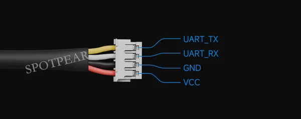

# DDSM210

**Waveshare** · Expansion

Revision: Not identified  
Coverage: Partial pinout collected; full reference still needed

[Browse all manufacturers](../../../../BROWSE.md) · [Desktop app](https://github.com/valleytechsolutions/black-wire-desktop)

## Pinout - Spotpear source

**pinout image** · Reviewed source · JPG

[Open original reference](../../../../library/media/f7d0b6c00973d8c5c1b1bc8887359582856dc1cc05e87fbaafad332927188f6f.jpg)

**Credit and rights:** Not established; source attribution retained. Source/manufacturer: Waveshare.

[Source 1](https://cdn.static.spotpear.com/uploads/picture/product/Robot-Car-Drone/Robot-Car/DDSM210/DDSM210-details-08-EN.jpg) · [Source 2](https://spotpear.com/shop/DDSM210-Direct-Drive-Servo-Hub-Motor-All-In-One-Serial-UART.html)

Source image saved from Spotpear. Manufacturer matched using visible branding, model and existing manufacturer documentation.

**Partial diagram. Confirm missing pins against the exact board documentation.**

SHA-256: `f7d0b6c00973d8c5c1b1bc8887359582856dc1cc05e87fbaafad332927188f6f`

Pin assignments have not been independently electrically verified. Check board revision before wiring.
