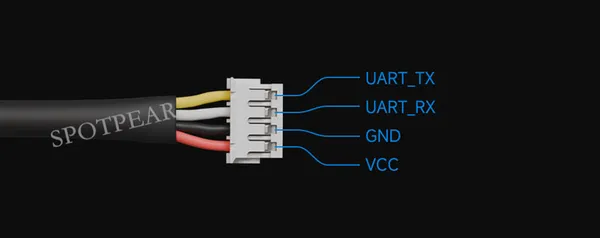

# DDSM210

**Waveshare** · Expansion

Revision: Not identified

Coverage: Partial pinout collected; full reference still needed

[Browse all manufacturers](../../../../BROWSE.md) · [Devices & IoT](../../../../DEVICES.md) · [Open in the browser guide](https://valleytech-black-wire-guide.pages.dev/?board=waveshare-expansion-ddsm210)

## Datasheets and original documentation

Board datasheet: **not yet recorded**. Visual reference: **available**.

Original manufacturer website still needs identification.

A chip datasheet, schematic and board datasheet have different scopes. Match the exact hardware revision.

[Documentation coverage and remaining gaps](../../../../DOCUMENTATION.md)

## Pinout - Spotpear source

**pinout image** · Reviewed source · JPG

[Open original reference](../../../../library/media/f7d0b6c00973d8c5c1b1bc8887359582856dc1cc05e87fbaafad332927188f6f.jpg)

**Credit and rights:** Not established; source attribution retained. Source/manufacturer: Waveshare.

[Source 1](https://cdn.static.spotpear.com/uploads/picture/product/Robot-Car-Drone/Robot-Car/DDSM210/DDSM210-details-08-EN.jpg) · [Source 2](https://spotpear.com/shop/DDSM210-Direct-Drive-Servo-Hub-Motor-All-In-One-Serial-UART.html)

Source image saved from Spotpear. Manufacturer matched using visible branding, model and existing manufacturer documentation.

Image revision: Not identified

SHA-256: `f7d0b6c00973d8c5c1b1bc8887359582856dc1cc05e87fbaafad332927188f6f`

Pin assignments have not been independently electrically verified. Check board revision before wiring.
