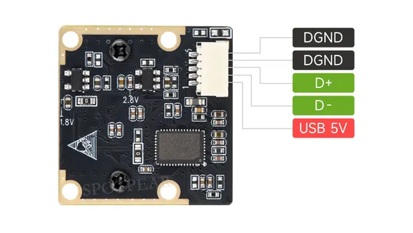

# OS05A20 5MP USB Camera (B)

**Waveshare** · Expansion

Revision: Not identified  
Coverage: Partial pinout collected; full reference still needed

[Browse all manufacturers](../../../../BROWSE.md) · [Desktop app](https://github.com/valleytechsolutions/black-wire-desktop)

## Pinout - Spotpear source

**pinout image** · Reviewed source · JPG

[Open original reference](../../../../library/media/d185f5e9c7c53d1cf40c75bd574247b6fd1b07649399a570cea82025115567b8.jpg)

**Credit and rights:** Not established; source attribution retained. Source/manufacturer: Waveshare.

[Source 1](https://cdn.static.spotpear.com/uploads/picture/product/module/camera/OS05A20-5MP-USB-Camera-B/OS05A20-5MP-USB-Camera-B-details-08.jpg) · [Source 2](https://spotpear.com/shop/USB-Camera-OS05A20-5MP-USB2.0-wide-angle.html)

Source image saved from Spotpear. Manufacturer matched using visible branding, model and existing manufacturer documentation.

**Partial diagram. Confirm missing pins against the exact board documentation.**

SHA-256: `d185f5e9c7c53d1cf40c75bd574247b6fd1b07649399a570cea82025115567b8`

Pin assignments have not been independently electrically verified. Check board revision before wiring.
