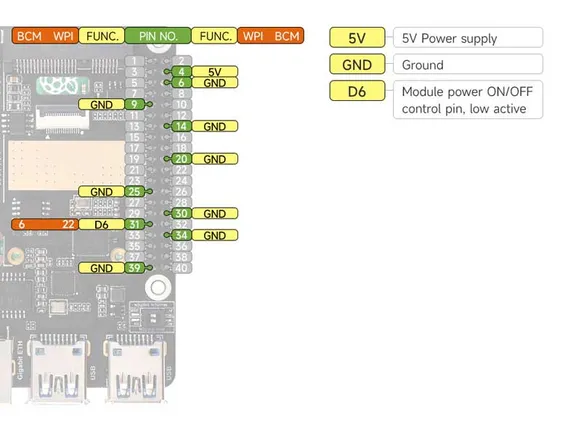

# PCIe TO MiniPCIe GbE USB3.2 HAT Plus

**Waveshare** · Expansion

Revision: Not identified  
Coverage: Partial pinout collected; full reference still needed

[Browse all manufacturers](../../../../BROWSE.md) · [Desktop app](https://github.com/valleytechsolutions/black-wire-desktop)

## Pinout - Spotpear source

**pinout image** · Reviewed source · JPG

[Open original reference](../../../../library/media/839f565a1ffb74ba7faf574cc90647abe5129180bcefefb5cbcf00092ea30d06.jpg)

**Credit and rights:** Not established; source attribution retained. Source/manufacturer: Waveshare.

[Source 1](https://cdn.static.spotpear.com/uploads/picture/product/raspberry-pi/rpi-expansion/PCIe-TO-MiniPCIe-GbE-USB3.2-HAT+/PCIe-TO-MiniPCIe-GbE-USB3.2-HAT-Plus-details-14-EN.jpg) · [Source 2](https://spotpear.com/shop/Rasberry-Pi-5-PCIe-MiniPCIe-4G-USB-HUB-Gigabit-Ethernet-RJ45-SIM7600G-EG25.html)

Source image saved from Spotpear. Manufacturer matched using visible branding, model and existing manufacturer documentation.

**Partial diagram. Confirm missing pins against the exact board documentation.**

SHA-256: `839f565a1ffb74ba7faf574cc90647abe5129180bcefefb5cbcf00092ea30d06`

Pin assignments have not been independently electrically verified. Check board revision before wiring.
