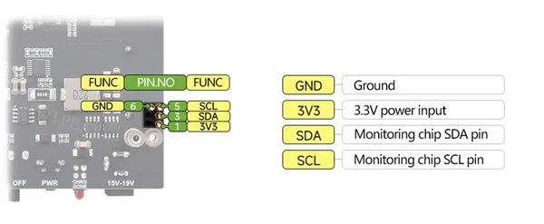

# UPS Power Module (C)

**Waveshare** · Expansion

Revision: Not identified  
Coverage: Partial pinout collected; full reference still needed

[Browse all manufacturers](../../../../BROWSE.md) · [Desktop app](https://github.com/valleytechsolutions/black-wire-desktop)

## Pinout - Spotpear source

**pinout image** · Reviewed source · JPG

[Open original reference](../../../../library/media/c2886cc0f071689e5a44edb9f6f80288f76b151bcb452bc3a6591ece67705632.jpg)

**Credit and rights:** Not established; source attribution retained. Source/manufacturer: Waveshare.

[Source 1](https://cdn.static.spotpear.com/uploads/picture/product/jetson/jetson-expansion-module/UPS-Power-Module-C/UPS-Power-Module-C-details-09-EN.jpg) · [Source 2](https://spotpear.com/shop/Jetson-Orin-Uninterruptible-Power-C-Simultaneously-Charging-Discharging/UPS-Power-Module-C.html)

Source image saved from Spotpear. Manufacturer matched using visible branding, model and existing manufacturer documentation.

**Partial diagram. Confirm missing pins against the exact board documentation.**

SHA-256: `c2886cc0f071689e5a44edb9f6f80288f76b151bcb452bc3a6591ece67705632`

Pin assignments have not been independently electrically verified. Check board revision before wiring.
