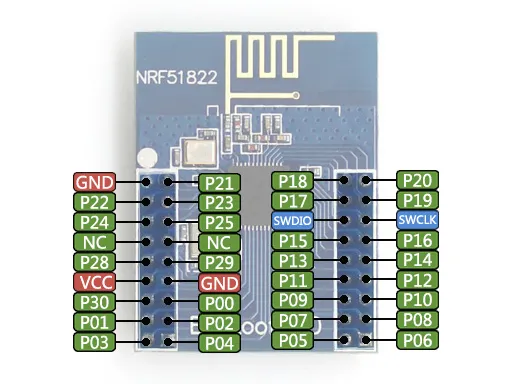

# Core51822

**Waveshare** · Other

Revision: Not identified  
Coverage: Pinout image collected

[Browse all manufacturers](../../../../BROWSE.md) · [Desktop app](https://github.com/valleytechsolutions/black-wire-desktop)

## Pinout

**pinout image** · Reviewed source · JPG

[Open original reference](../../../../library/media/d9e02e47519ebc95edb06523417b877eb92c4cb1cf7e15daf707aa1af07eff5f.jpg)

**Credit and rights:** Not recorded; retain original attribution. Source/manufacturer: Waveshare.

[Source 1](https://www.waveshare.com/img/devkit/accBoard/Core51822/Core51822-pin.jpg) · [Source 2](https://www.waveshare.com/core51822.htm) · [Source 3](https://www.waveshare.com/nrf51822-eval-kit.htm)

SHA-256: `d9e02e47519ebc95edb06523417b877eb92c4cb1cf7e15daf707aa1af07eff5f`

Pin assignments have not been independently electrically verified. Check board revision before wiring.
