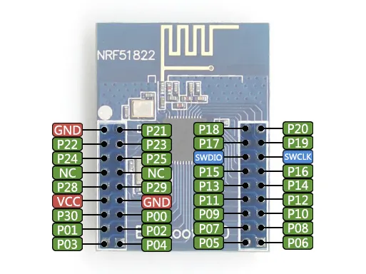

# Core51822

**Waveshare** · Other

Revision: Not identified

Coverage: Pinout image collected

[Browse all manufacturers](../../../../BROWSE.md) · [Devices & IoT](../../../../DEVICES.md) · [Open in the browser guide](https://valleytech-black-wire-guide.pages.dev/?board=waveshare-other-core51822)

## Datasheets and original documentation

Board datasheet: **not yet recorded**. Visual reference: **available**.

[Manufacturer source (recorded link)](https://www.waveshare.com/core51822.htm)

A chip datasheet, schematic and board datasheet have different scopes. Match the exact hardware revision.

[Documentation coverage and remaining gaps](../../../../DOCUMENTATION.md)

## Pinout

**pinout image** · Reviewed source · JPG

[Open original reference](../../../../library/media/d9e02e47519ebc95edb06523417b877eb92c4cb1cf7e15daf707aa1af07eff5f.jpg)

**Credit and rights:** Not recorded; retain original attribution. Source/manufacturer: Waveshare.

[Source 1](https://www.waveshare.com/img/devkit/accBoard/Core51822/Core51822-pin.jpg) · [Source 2](https://www.waveshare.com/core51822.htm) · [Source 3](https://www.waveshare.com/nrf51822-eval-kit.htm)

Image revision: Not identified

SHA-256: `d9e02e47519ebc95edb06523417b877eb92c4cb1cf7e15daf707aa1af07eff5f`

Pin assignments have not been independently electrically verified. Check board revision before wiring.
