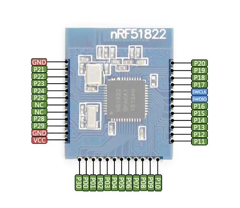

# Core51822 (B)

**Waveshare** · Other

Revision: Not identified  
Coverage: Pinout image collected

[Browse all manufacturers](../../../../BROWSE.md) · [Desktop app](https://github.com/valleytechsolutions/black-wire-desktop)

## Pinout

**pinout image** · Reviewed source · JPG

[Open original reference](../../../../library/media/5701b9b088470d1601165ea62b467242c7593b7bf0c1849f5367e1f4678a0e54.jpg)

**Credit and rights:** Not recorded; retain original attribution. Source/manufacturer: Waveshare.

[Source 1](https://www.waveshare.com/img/devkit/accBoard/Core51822-B/Core51822-B-pin.jpg) · [Source 2](https://www.waveshare.com/core51822-b.htm)

SHA-256: `5701b9b088470d1601165ea62b467242c7593b7bf0c1849f5367e1f4678a0e54`

Pin assignments have not been independently electrically verified. Check board revision before wiring.
