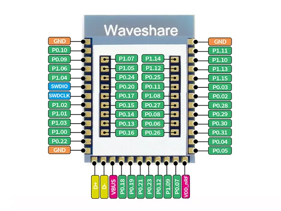

# Core52840

**Waveshare** · Other

Revision: Not identified  
Coverage: Pinout image collected

[Browse all manufacturers](../../../../BROWSE.md) · [Desktop app](https://github.com/valleytechsolutions/black-wire-desktop)

## Pinout

**pinout image** · Reviewed source · JPG

[Open original reference](../../../../library/media/711776af767798b073c8c4aaaa861f9d1224140da3817284a3adcaee10261b68.jpg)

**Credit and rights:** Not recorded; retain original attribution. Source/manufacturer: Waveshare.

[Source 1](https://www.waveshare.com/img/devkit/accBoard/Core52840/Core52840-pins.jpg) · [Source 2](https://www.waveshare.com/core52840.htm)

Core52840 module supplied in the NRF52840 Eval Kit; diagram identifies the core module pins.

SHA-256: `711776af767798b073c8c4aaaa861f9d1224140da3817284a3adcaee10261b68`

Pin assignments have not been independently electrically verified. Check board revision before wiring.
