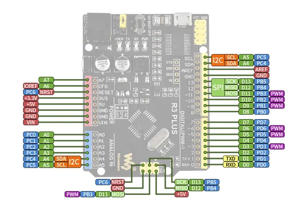

# R3 PLUS

**Waveshare** · Other

Revision: Not identified  
Coverage: Pinout image collected

[Browse all manufacturers](../../../../BROWSE.md) · [Desktop app](https://github.com/valleytechsolutions/black-wire-desktop)

## Pinout

**pinout image** · Reviewed source · JPG

[Open original reference](../../../../library/media/b86bc034a4640865e457bbc953509c38c3527a9eb2bcccc3720dcc7007fb9958.jpg)

**Credit and rights:** Not recorded; retain original attribution. Source/manufacturer: Waveshare.

[Source 1](https://www.waveshare.com/w/upload/a/a9/R3-PLUS-details-inter.jpg) · [Source 2](https://www.waveshare.com/wiki/R3_PLUS)

SHA-256: `b86bc034a4640865e457bbc953509c38c3527a9eb2bcccc3720dcc7007fb9958`

Pin assignments have not been independently electrically verified. Check board revision before wiring.
