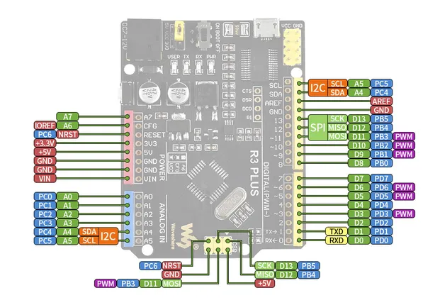

# R3 PLUS

**Waveshare** · Other

Revision: Not identified

Coverage: Pinout image collected

[Browse all manufacturers](../../../../BROWSE.md) · [Devices & IoT](../../../../DEVICES.md) · [Open in the browser guide](https://valleytech-black-wire-guide.pages.dev/?board=waveshare-other-r3-plus)

## Datasheets and original documentation

Board datasheet: **not yet recorded**. Visual reference: **available**.

[Manufacturer source (recorded link)](https://www.waveshare.com/wiki/R3_PLUS)

A chip datasheet, schematic and board datasheet have different scopes. Match the exact hardware revision.

[Documentation coverage and remaining gaps](../../../../DOCUMENTATION.md)

## Pinout

**pinout image** · Reviewed source · JPG

[Open original reference](../../../../library/media/b86bc034a4640865e457bbc953509c38c3527a9eb2bcccc3720dcc7007fb9958.jpg)

**Credit and rights:** Not recorded; retain original attribution. Source/manufacturer: Waveshare.

[Source 1](https://www.waveshare.com/w/upload/a/a9/R3-PLUS-details-inter.jpg) · [Source 2](https://www.waveshare.com/wiki/R3_PLUS)

Image revision: Not identified

SHA-256: `b86bc034a4640865e457bbc953509c38c3527a9eb2bcccc3720dcc7007fb9958`

Pin assignments have not been independently electrically verified. Check board revision before wiring.
