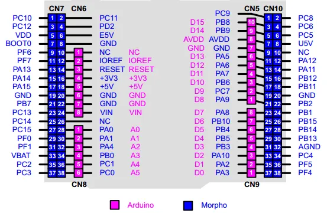

# XNUCLEO-F030R8

**Waveshare** · Other

Revision: Not identified  
Coverage: Pinout image collected

[Browse all manufacturers](../../../../BROWSE.md) · [Desktop app](https://github.com/valleytechsolutions/black-wire-desktop)

## Arduino and Morpho headers

**pinout image** · Reviewed source · PNG

[Open original reference](../../../../library/media/05ce019d9d12bcdd325f72888c79d41a048bdebfaf08ab0fdee90deb771e08e9.png)

**Credit and rights:** Not recorded by source. Source/manufacturer: Waveshare.

[Source 1](https://www.waveshare.com/wiki/upload/d/d1/Xnucleo-UserManual.pdf)

Original embedded bitmap extracted from manual v2.6.2, page 14. Limited source resolution; not upscaled.

SHA-256: `05ce019d9d12bcdd325f72888c79d41a048bdebfaf08ab0fdee90deb771e08e9`

Pin assignments have not been independently electrically verified. Check board revision before wiring.
