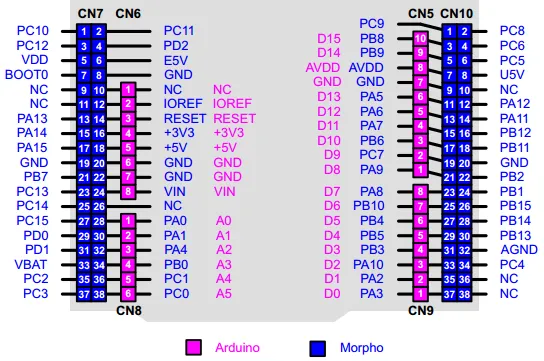

# XNUCLEO-F103RB

**Waveshare** · Other

Revision: Not identified

Coverage: Pinout image collected

[Browse all manufacturers](../../../../BROWSE.md) · [Devices & IoT](../../../../DEVICES.md) · [Open in the browser guide](https://valleytech-black-wire-guide.pages.dev/?board=waveshare-other-xnucleo-f103rb)

## Datasheets and original documentation

Board datasheet: **not yet recorded**. Visual reference: **available**.

[Manufacturer source (recorded link)](https://www.waveshare.com/wiki/XNUCLEO-F103RB)

- **hardware-guide / board**: [XNucleo user manual v2.6.2 — exact model figures on pages 14–15](https://www.waveshare.com/wiki/upload/d/d1/Xnucleo-UserManual.pdf) · online

The old model wiki page returns not found. The family manual contains model-specific pinout figures; match the printed model exactly. Local source images remain available.

[Documentation coverage and remaining gaps](../../../../DOCUMENTATION.md)

## Arduino and Morpho headers

**pinout image** · Reviewed source · PNG

[Open original reference](../../../../library/media/2343281aee7c818e277c014b9c3f089c95a99bb763262c502f327df9769cf9c8.png)

**Credit and rights:** Not recorded by source. Source/manufacturer: Waveshare.

[Source 1](https://www.waveshare.com/wiki/upload/d/d1/Xnucleo-UserManual.pdf)

Original embedded bitmap extracted from manual v2.6.2, page 14. Limited source resolution; not upscaled.

Image revision: Not identified

SHA-256: `2343281aee7c818e277c014b9c3f089c95a99bb763262c502f327df9769cf9c8`

Pin assignments have not been independently electrically verified. Check board revision before wiring.
