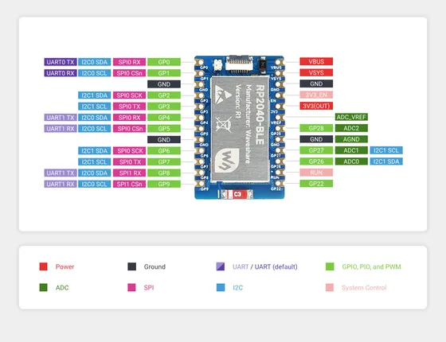
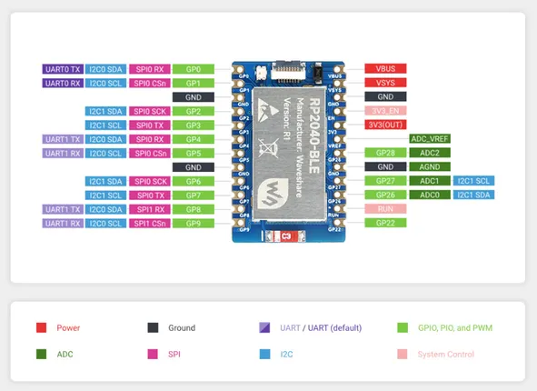

# RP2040-BLE

**Waveshare** · RP2040

Revision: Not identified  
Coverage: Pinout image collected

[Browse all manufacturers](../../../../BROWSE.md) · [Desktop app](https://github.com/valleytechsolutions/black-wire-desktop)

## Pinout

**pinout image** · Reviewed source · JPG

[Open original reference](../../../../library/media/f025e397b128443d462d14ab33d1f4ea95ab5010193f08f28867c1c557ab7678.jpg)

**Credit and rights:** Not recorded; retain original attribution. Source/manufacturer: Waveshare.

[Source 1](https://www.waveshare.com/img/devkit/RP2040-BLE-Kit/RP2040-BLE-Kit-details-inter.jpg) · [Source 2](https://www.waveshare.com/rp2040-ble.htm)

SHA-256: `f025e397b128443d462d14ab33d1f4ea95ab5010193f08f28867c1c557ab7678`

## Pinout

**pinout image** · Reviewed source · PNG

[Open original reference](../../../../library/media/4d98230f6ffa97f442beae6075518db7afb065d08f06711bd4609b60583a9954.png)

**Credit and rights:** Not recorded; retain original attribution. Source/manufacturer: Waveshare.

[Source 1](https://www.waveshare.com/w/upload/1/11/RP2040-BLE-Kit-details-inter.png) · [Source 2](https://www.waveshare.com/wiki/RP2040-BLE)

SHA-256: `4d98230f6ffa97f442beae6075518db7afb065d08f06711bd4609b60583a9954`

Pin assignments have not been independently electrically verified. Check board revision before wiring.
