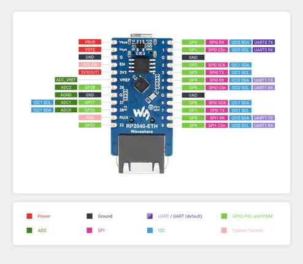

# RP2040-ETH

**Waveshare** · RP2040

Revision: Not identified

Coverage: Pinout image collected

[Browse all manufacturers](../../../../BROWSE.md) · [Devices & IoT](../../../../DEVICES.md) · [Open in the browser guide](https://valleytech-black-wire-guide.pages.dev/?board=waveshare-rp2040-rp2040-eth)

## Datasheets and original documentation

Board datasheet: **not yet recorded**. Visual reference: **available**.

[Manufacturer source (recorded link)](https://www.waveshare.com/wiki/RP2040-ETH)

A chip datasheet, schematic and board datasheet have different scopes. Match the exact hardware revision.

[Documentation coverage and remaining gaps](../../../../DOCUMENTATION.md)

## Pinout

**pinout image** · Reviewed source · JPG

[Open original reference](../../../../library/media/7bbbcb9123fdaeaae7b2de594daf7508891b4d32d3fbe4835b3c0d1e2d4074d7.jpg)

**Credit and rights:** Not recorded; retain original attribution. Source/manufacturer: Waveshare.

[Source 1](https://www.waveshare.com/w/upload/1/1a/RP2040-ETH02.jpg) · [Source 2](https://www.waveshare.com/wiki/RP2040-ETH) · [Source 3](https://www.waveshare.com/rp2040-eth.htm)

Image revision: Not identified

SHA-256: `7bbbcb9123fdaeaae7b2de594daf7508891b4d32d3fbe4835b3c0d1e2d4074d7`

Pin assignments have not been independently electrically verified. Check board revision before wiring.
