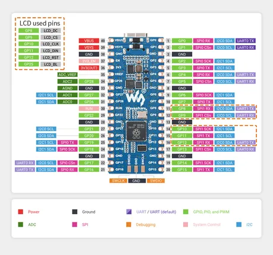
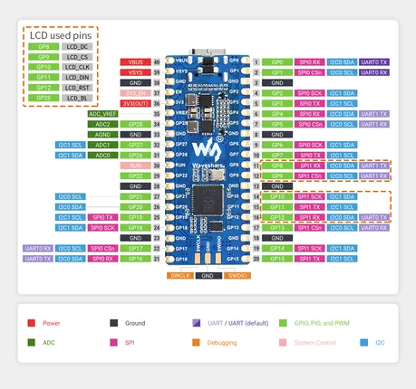

# RP2040-LCD-0.96

**Waveshare** · RP2040

Revision: Not identified  
Coverage: Pinout image collected

[Browse all manufacturers](../../../../BROWSE.md) · [Desktop app](https://github.com/valleytechsolutions/black-wire-desktop)

## Pinout

**pinout image** · Reviewed source · JPG

[Open original reference](../../../../library/media/fe538e3c89fdddd13eb2657d6e8b03bf44bdb75a70074a753b9c964fa93b335e.jpg)

**Credit and rights:** Not recorded; retain original attribution. Source/manufacturer: Waveshare.

[Source 1](https://www.waveshare.com/img/devkit/RP2040-LCD-0.96/RP2040-LCD-0.96-details-7.jpg) · [Source 2](https://www.waveshare.com/rp2040-lcd-0.96.htm)

SHA-256: `fe538e3c89fdddd13eb2657d6e8b03bf44bdb75a70074a753b9c964fa93b335e`

## Pinout

**pinout image** · Reviewed source · JPG

[Open original reference](../../../../library/media/ad3775397980d6a85807da92466c3ec44d5b0b47ef32d23487453aad4fbefd61.jpg)

**Credit and rights:** Not recorded; retain original attribution. Source/manufacturer: Waveshare.

[Source 1](https://www.waveshare.com/w/upload/8/8e/RP2040-LCD-0.96-details-7.jpg) · [Source 2](https://www.waveshare.com/wiki/RP2040-LCD-0.96)

SHA-256: `ad3775397980d6a85807da92466c3ec44d5b0b47ef32d23487453aad4fbefd61`

Pin assignments have not been independently electrically verified. Check board revision before wiring.
