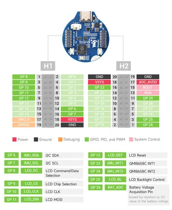
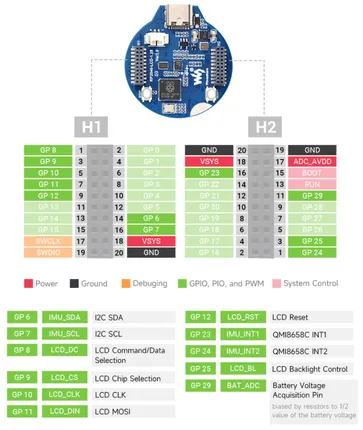

# RP2040-LCD-1.28

**Waveshare** · RP2040

Revision: Not identified  
Coverage: Pinout image collected

[Browse all manufacturers](../../../../BROWSE.md) · [Desktop app](https://github.com/valleytechsolutions/black-wire-desktop)

## Pinout

**pinout image** · Reviewed source · JPG

[Open original reference](../../../../library/media/e27cb59d23dd8451328097e933af18766a913c455f3d4c9796dc1065489f1dc8.jpg)

**Credit and rights:** Not recorded; retain original attribution. Source/manufacturer: Waveshare.

[Source 1](https://www.waveshare.com/img/devkit/RP2040-LCD-1.28/RP2040-LCD-1.28-details-3.jpg) · [Source 2](https://www.waveshare.com/rp2040-lcd-1.28.htm) · [Source 3](https://www.waveshare.com/rp2040-lcd-1.28-b.htm)

SHA-256: `e27cb59d23dd8451328097e933af18766a913c455f3d4c9796dc1065489f1dc8`

## Pinout

**pinout image** · Reviewed source · PNG

[Open original reference](../../../../library/media/dd7b49892f37827c5aa409d4466958b0b9e51dcec7c2cbb9ee01fbd377ab5ec4.png)

**Credit and rights:** Not recorded; retain original attribution. Source/manufacturer: Waveshare.

[Source 1](https://www.waveshare.com/w/upload/3/37/RP2040-LCD-1.28_Spec01.png) · [Source 2](https://www.waveshare.com/wiki/RP2040-LCD-1.28)

SHA-256: `dd7b49892f37827c5aa409d4466958b0b9e51dcec7c2cbb9ee01fbd377ab5ec4`

Pin assignments have not been independently electrically verified. Check board revision before wiring.
