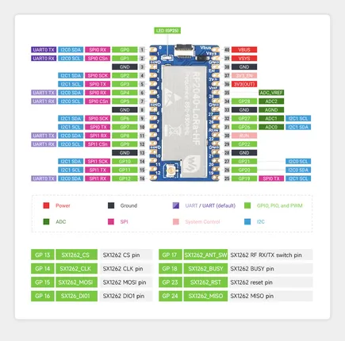

# RP2040-LoRa

**Waveshare** · RP2040

Revision: Not identified  
Coverage: Pinout image collected

[Browse all manufacturers](../../../../BROWSE.md) · [Desktop app](https://github.com/valleytechsolutions/black-wire-desktop)

## Pinout

**pinout image** · Reviewed source · JPG

[Open original reference](../../../../library/media/67d02c9a62838756b5e27ef1b386177b06e23ec8bb2a79719b4fce2e07138347.jpg)

**Credit and rights:** Not recorded; retain original attribution. Source/manufacturer: Waveshare.

[Source 1](https://www.waveshare.com/w/upload/8/82/RP2040-LoRa_Pinout.jpg) · [Source 2](https://www.waveshare.com/wiki/RP2040-LoRa) · [Source 3](https://www.waveshare.com/rp2040-lora.htm)

SHA-256: `67d02c9a62838756b5e27ef1b386177b06e23ec8bb2a79719b4fce2e07138347`

Pin assignments have not been independently electrically verified. Check board revision before wiring.
