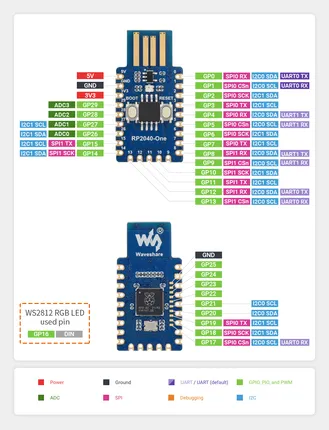

# RP2040-One

**Waveshare** · RP2040

Revision: Not identified  
Coverage: Pinout image collected

[Browse all manufacturers](../../../../BROWSE.md) · [Desktop app](https://github.com/valleytechsolutions/black-wire-desktop)

## Pinout

**pinout image** · Reviewed source · JPG

[Open original reference](../../../../library/media/cbc7e9543320a00720f849e0692a6de0ae9045d789dc9bacda424e69e5f05bc0.jpg)

**Credit and rights:** Not recorded; retain original attribution. Source/manufacturer: Waveshare.

[Source 1](https://www.waveshare.com/w/upload/6/63/RP2040-One_Spec001.jpg) · [Source 2](https://www.waveshare.com/wiki/RP2040-One) · [Source 3](https://www.waveshare.com/rp2040-one.htm)

SHA-256: `cbc7e9543320a00720f849e0692a6de0ae9045d789dc9bacda424e69e5f05bc0`

Pin assignments have not been independently electrically verified. Check board revision before wiring.
