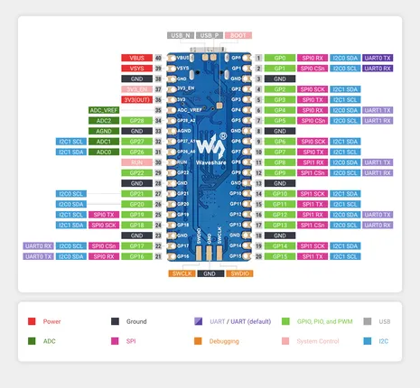

# RP2040-Plus

**Waveshare** · RP2040

Revision: Not identified  
Coverage: Pinout image collected

[Browse all manufacturers](../../../../BROWSE.md) · [Desktop app](https://github.com/valleytechsolutions/black-wire-desktop)

## Pinout

**pinout image** · Reviewed source · JPG

[Open original reference](../../../../library/media/f05f91341cde6eb63b17c7192850ec171f37ee61955f9dcbd3349d426a5fd583.jpg)

**Credit and rights:** Not recorded; retain original attribution. Source/manufacturer: Waveshare.

[Source 1](https://www.waveshare.com/img/devkit/RP2040-Plus/RP2040-Plus-details-7.jpg) · [Source 2](https://www.waveshare.com/rp2040-plus.htm)

SHA-256: `f05f91341cde6eb63b17c7192850ec171f37ee61955f9dcbd3349d426a5fd583`

## Pinout

**pinout image** · Reviewed source · JPG

[Open original reference](../../../../library/media/8bf936a0fa1fd2e5b926a4ddb4f6999d9281326d5aa1b31d5535774e3cac2865.jpg)

**Credit and rights:** Not recorded; retain original attribution. Source/manufacturer: Waveshare.

[Source 1](https://www.waveshare.com/w/upload/e/e2/RP2040-Plus-details-7.jpg) · [Source 2](https://www.waveshare.com/wiki/RP2040-Plus)

SHA-256: `8bf936a0fa1fd2e5b926a4ddb4f6999d9281326d5aa1b31d5535774e3cac2865`

## Pinout

**pinout image** · Reviewed source · WEBP

[Open original reference](../../../../library/media/c79ca1428857fcd62b317a7fe95c568ba332eeea8a81e2af96b8b78df567dfbe.webp)

**Credit and rights:** Not recorded; retain original attribution. Source/manufacturer: Waveshare.

[Source 1](https://docs.waveshare.com/assets/images/RP2040-Plus-details-727e9849d7ed30eca0cd637def5d882d.webp) · [Source 2](https://docs.waveshare.com/RP2040-Plus)

SHA-256: `c79ca1428857fcd62b317a7fe95c568ba332eeea8a81e2af96b8b78df567dfbe`

Pin assignments have not been independently electrically verified. Check board revision before wiring.
