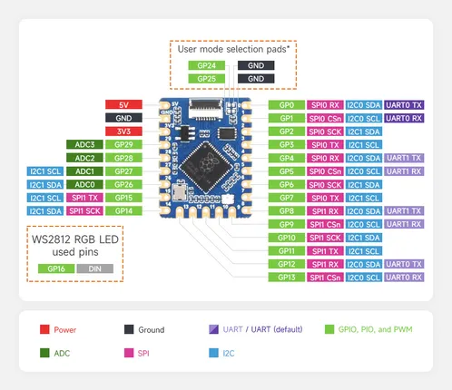
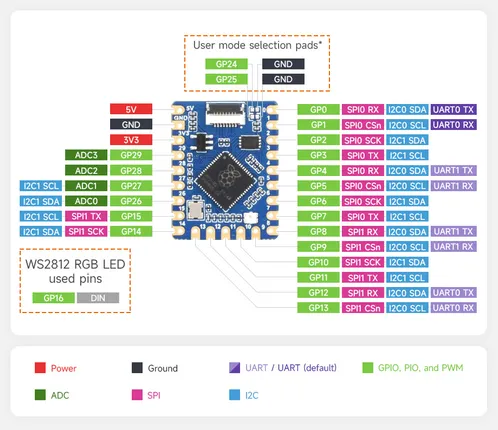

# RP2040-Tiny

**Waveshare** · RP2040

Revision: Not identified  
Coverage: Pinout image collected

[Browse all manufacturers](../../../../BROWSE.md) · [Desktop app](https://github.com/valleytechsolutions/black-wire-desktop)

## Pinout

**pinout image** · Reviewed source · JPG

[Open original reference](../../../../library/media/6ab5f80defb363c23bf60ed533e26e5eeb1037d3697897e56f65a77da2df5f91.jpg)

**Credit and rights:** Not recorded; retain original attribution. Source/manufacturer: Waveshare.

[Source 1](https://www.waveshare.com/img/devkit/RP2040-Tiny-Kit/RP2040-Tiny-Kit-details-11.jpg) · [Source 2](https://www.waveshare.com/rp2040-tiny.htm)

SHA-256: `6ab5f80defb363c23bf60ed533e26e5eeb1037d3697897e56f65a77da2df5f91`

## Pinout

**pinout image** · Reviewed source · PNG

[Open original reference](../../../../library/media/520d5b7f3dd15cccad36d070814c4345d1f711e156c6f604393e7b9c5ec657ee.png)

**Credit and rights:** Not recorded; retain original attribution. Source/manufacturer: Waveshare.

[Source 1](https://www.waveshare.com/w/upload/f/f2/RP2040-Tiny-Kit-details-11.png) · [Source 2](https://www.waveshare.com/wiki/RP2040-Tiny)

SHA-256: `520d5b7f3dd15cccad36d070814c4345d1f711e156c6f604393e7b9c5ec657ee`

Pin assignments have not been independently electrically verified. Check board revision before wiring.
