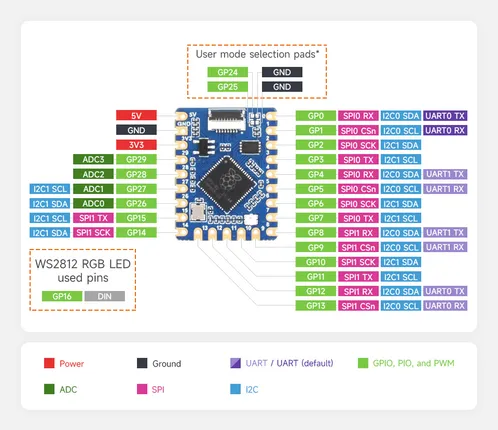
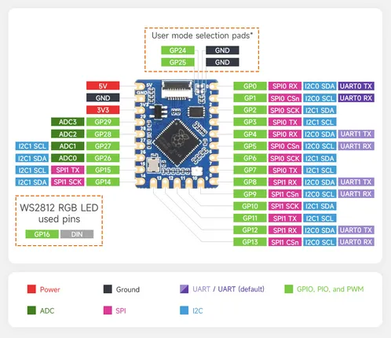

# RP2040-Tiny

**Waveshare** · RP2040

Revision: Not identified

Coverage: Pinout image collected

[Browse all manufacturers](../../../../BROWSE.md) · [Devices & IoT](../../../../DEVICES.md) · [Open in the browser guide](https://valleytech-black-wire-guide.pages.dev/?board=waveshare-rp2040-rp2040-tiny)

## Datasheets and original documentation

Board datasheet: **not yet recorded**. Visual reference: **available**.

[Manufacturer source (recorded link)](https://www.waveshare.com/rp2040-tiny.htm)

A chip datasheet, schematic and board datasheet have different scopes. Match the exact hardware revision.

[Documentation coverage and remaining gaps](../../../../DOCUMENTATION.md)

## Pinout

**pinout image** · Reviewed source · JPG

[Open original reference](../../../../library/media/6ab5f80defb363c23bf60ed533e26e5eeb1037d3697897e56f65a77da2df5f91.jpg)

**Credit and rights:** Not recorded; retain original attribution. Source/manufacturer: Waveshare.

[Source 1](https://www.waveshare.com/img/devkit/RP2040-Tiny-Kit/RP2040-Tiny-Kit-details-11.jpg) · [Source 2](https://www.waveshare.com/rp2040-tiny.htm)

Image revision: Not identified

SHA-256: `6ab5f80defb363c23bf60ed533e26e5eeb1037d3697897e56f65a77da2df5f91`

## Pinout

**pinout image** · Reviewed source · PNG

[Open original reference](../../../../library/media/520d5b7f3dd15cccad36d070814c4345d1f711e156c6f604393e7b9c5ec657ee.png)

**Credit and rights:** Not recorded; retain original attribution. Source/manufacturer: Waveshare.

[Source 1](https://www.waveshare.com/w/upload/f/f2/RP2040-Tiny-Kit-details-11.png) · [Source 2](https://www.waveshare.com/wiki/RP2040-Tiny)

Image revision: Not identified

SHA-256: `520d5b7f3dd15cccad36d070814c4345d1f711e156c6f604393e7b9c5ec657ee`

Pin assignments have not been independently electrically verified. Check board revision before wiring.
