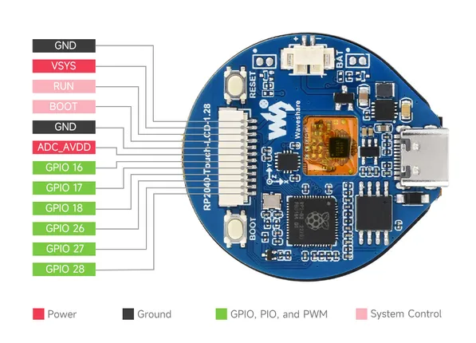

# RP2040-Touch-LCD-1.28

**Waveshare** · RP2040

Revision: Not identified  
Coverage: Pinout image collected

[Browse all manufacturers](../../../../BROWSE.md) · [Desktop app](https://github.com/valleytechsolutions/black-wire-desktop)

## Pinout

**pinout image** · Reviewed source · JPG

[Open original reference](../../../../library/media/fa80fa9c07fe00d36864e5039bf4491c15f8f0d0d31b075c4259fda68c48b656.jpg)

**Credit and rights:** Not recorded; retain original attribution. Source/manufacturer: Waveshare.

[Source 1](https://www.waveshare.com/w/upload/e/ef/RP2040-Touch-LCD-1.28-details-13.jpg) · [Source 2](https://www.waveshare.com/wiki/RP2040-Touch-LCD-1.28) · [Source 3](https://www.waveshare.com/rp2040-touch-lcd-1.28.htm) · [Source 4](https://www.waveshare.com/rp2040-touch-lcd-1.28-b.htm)

SHA-256: `fa80fa9c07fe00d36864e5039bf4491c15f8f0d0d31b075c4259fda68c48b656`

Pin assignments have not been independently electrically verified. Check board revision before wiring.
