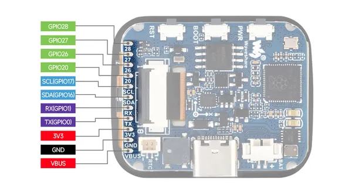
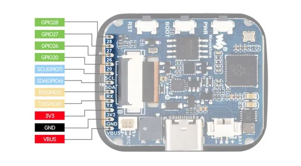

# RP2040-Touch-LCD-1.69

**Waveshare** · RP2040

Revision: Not identified  
Coverage: Pinout image collected

[Browse all manufacturers](../../../../BROWSE.md) · [Desktop app](https://github.com/valleytechsolutions/black-wire-desktop)

## Pinout

**pinout image** · Reviewed source · JPG

[Open original reference](../../../../library/media/142cc953b8fe515c7c5843490ac65bca17e2b7ca935e7176d32af941b7587b0f.jpg)

**Credit and rights:** Not recorded; retain original attribution. Source/manufacturer: Waveshare.

[Source 1](https://www.waveshare.com/img/devkit/RP2040-Touch-LCD-1.69/RP2040-Touch-LCD-1.69-details-9.jpg) · [Source 2](https://www.waveshare.com/rp2040-touch-lcd-1.69.htm)

SHA-256: `142cc953b8fe515c7c5843490ac65bca17e2b7ca935e7176d32af941b7587b0f`

## Pinout

**pinout image** · Reviewed source · JPG

[Open original reference](../../../../library/media/6eacca10e1464d94f9a1bcb2b3b20e02b9aca500d0ece45d813098219c0671f8.jpg)

**Credit and rights:** Not recorded; retain original attribution. Source/manufacturer: Waveshare.

[Source 1](https://www.waveshare.com/w/upload/1/15/RP2040-Touch-LCD-1.6902.jpg) · [Source 2](https://www.waveshare.com/wiki/RP2040-Touch-LCD-1.69)

SHA-256: `6eacca10e1464d94f9a1bcb2b3b20e02b9aca500d0ece45d813098219c0671f8`

Pin assignments have not been independently electrically verified. Check board revision before wiring.
