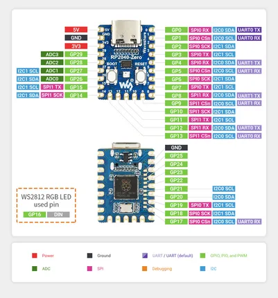
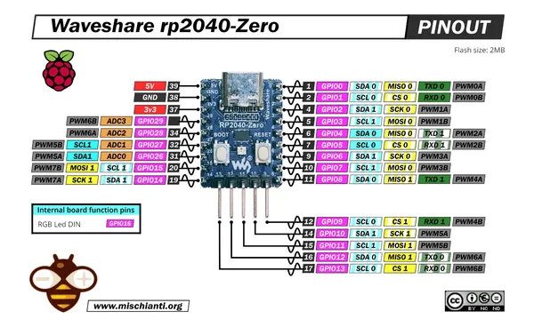

# RP2040-Zero

**Waveshare** · RP2040

Revision: Not identified  
Coverage: Pinout image collected

[Browse all manufacturers](../../../../BROWSE.md) · [Desktop app](https://github.com/valleytechsolutions/black-wire-desktop)

## Pinout

**pinout image** · Reviewed source · JPG

[Open original reference](../../../../library/media/3ac09fe059101fdab7ebc6021b3db52cbe71ce75d07b10b673537446289bdb90.jpg)

**Credit and rights:** Not recorded; retain original attribution. Source/manufacturer: Waveshare.

[Source 1](https://www.waveshare.com/img/devkit/RP2040-Zero/RP2040-Zero-details-7.jpg) · [Source 2](https://www.waveshare.com/rp2040-zero.htm)

SHA-256: `3ac09fe059101fdab7ebc6021b3db52cbe71ce75d07b10b673537446289bdb90`

## Pinout

**pinout image** · Reviewed source · JPG

[Open original reference](../../../../library/media/b2fc91157b61b92ba29fad8cbd0307baf1a924b93e906a3780642691a85f921a.jpg)

**Credit and rights:** Not recorded; retain original attribution. Source/manufacturer: Waveshare.

[Source 1](https://www.waveshare.com/w/upload/1/1f/900px-RP2040-Zero-details-7.jpg) · [Source 2](https://www.waveshare.com/wiki/RP2040-Zero)

SHA-256: `b2fc91157b61b92ba29fad8cbd0307baf1a924b93e906a3780642691a85f921a`

## Pinout - Renzo Mischianti

**pinout image** · Reviewed source · JPG

[Open original reference](../../../../library/media/316ff346c17e6cf5a7232234bc088c7b6358116765d7a89fc5bd452ed3946e29.jpg)

**Credit and rights:** CC BY-NC-ND marking visible on image; exact license version and publication permissions not established. Source/manufacturer: Waveshare.

[Source 1](https://mischianti.org/wp-content/uploads/2022/09/Waveshare-rp2040-zero-Raspberry-Pi-Pico-alternative-pinout.jpg) · [Source 2](https://mischianti.org/waveshare-rp2040-zero-high-resolution-pinout-and-specs/)

Original public image by Renzo Mischianti, unchanged. Diagram/model matching is visual, not electrical verification. Exact PCB layout and revision must match; no inference of compatibility with lookalike marketplace clones.

SHA-256: `316ff346c17e6cf5a7232234bc088c7b6358116765d7a89fc5bd452ed3946e29`

Pin assignments have not been independently electrically verified. Check board revision before wiring.
