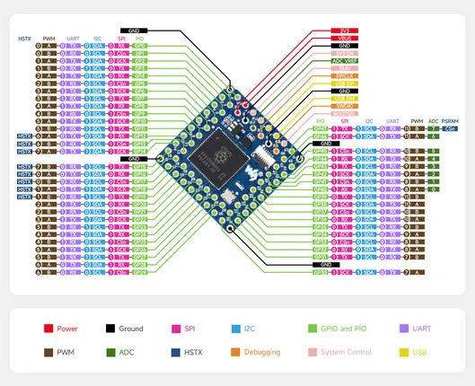

# Core2350B

**Waveshare** · RP2350

Revision: Not identified  
Coverage: Pinout image collected

[Browse all manufacturers](../../../../BROWSE.md) · [Desktop app](https://github.com/valleytechsolutions/black-wire-desktop)

## Pinout

**pinout image** · Reviewed source · JPG

[Open original reference](../../../../library/media/f9a1e443a5b4a73cb487b1c22ae95a2e7fbd236160453be55563e0ca8d6ce05a.jpg)

**Credit and rights:** Not recorded; retain original attribution. Source/manufacturer: Waveshare.

[Source 1](https://www.waveshare.com/w/upload/d/d9/Core2350B0-details-inter%283%29.jpg) · [Source 2](https://www.waveshare.com/wiki/Core2350B0) · [Source 3](https://www.waveshare.com/core2350b.htm)

SHA-256: `f9a1e443a5b4a73cb487b1c22ae95a2e7fbd236160453be55563e0ca8d6ce05a`

Pin assignments have not been independently electrically verified. Check board revision before wiring.
