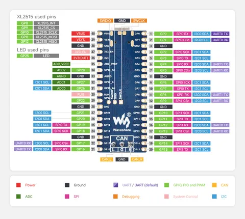
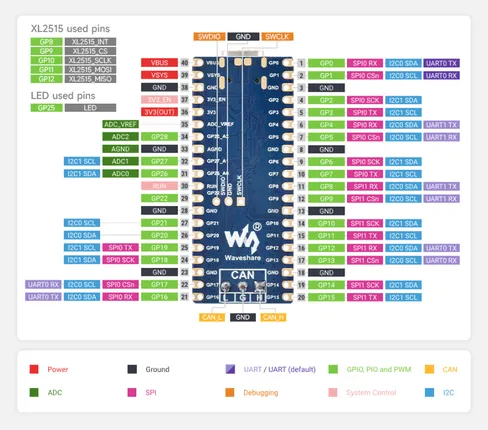

# RP2350-CAN

**Waveshare** · RP2350

Revision: Not identified

Coverage: Pinout image collected

[Browse all manufacturers](../../../../BROWSE.md) · [Devices & IoT](../../../../DEVICES.md) · [Open in the browser guide](https://valleytech-black-wire-guide.pages.dev/?board=waveshare-rp2350-rp2350-can)

## Datasheets and original documentation

Board datasheet: **not yet recorded**. Visual reference: **available**.

[Manufacturer source (recorded link)](https://www.waveshare.com/rp2350-can.htm)

A chip datasheet, schematic and board datasheet have different scopes. Match the exact hardware revision.

[Documentation coverage and remaining gaps](../../../../DOCUMENTATION.md)

## Pinout

**pinout image** · Reviewed source · JPG

[Open original reference](../../../../library/media/9426a785920e15fd879fae5b5e9bb0a43184f0595dc9b7128f4292958e917e8a.jpg)

**Credit and rights:** Not recorded; retain original attribution. Source/manufacturer: Waveshare.

[Source 1](https://www.waveshare.com/img/devkit/RP2350-CAN/RP2350-CAN-details-inter.jpg) · [Source 2](https://www.waveshare.com/rp2350-can.htm)

Image revision: Not identified

SHA-256: `9426a785920e15fd879fae5b5e9bb0a43184f0595dc9b7128f4292958e917e8a`

## Pinout

**pinout image** · Reviewed source · PNG

[Open original reference](../../../../library/media/d10a2e0365a8a8726bd90ebaf864c9168d8e7c7faa9adeb60b63cff1a6076516.png)

**Credit and rights:** Not recorded; retain original attribution. Source/manufacturer: Waveshare.

[Source 1](https://www.waveshare.com/w/upload/4/44/680px-RP2350-CAN-details-inter.png) · [Source 2](https://www.waveshare.com/wiki/RP2350-CAN)

Image revision: Not identified

SHA-256: `d10a2e0365a8a8726bd90ebaf864c9168d8e7c7faa9adeb60b63cff1a6076516`

Pin assignments have not been independently electrically verified. Check board revision before wiring.
