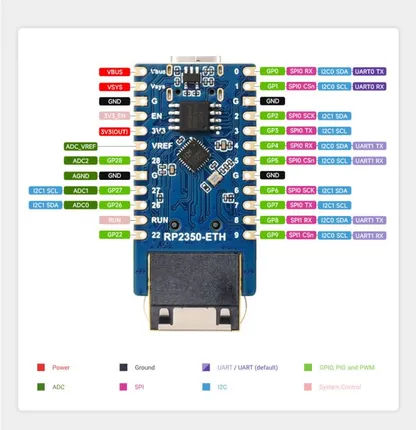

# RP2350-ETH

**Waveshare** · RP2350

Revision: Not identified

Coverage: Pinout image collected

[Browse all manufacturers](../../../../BROWSE.md) · [Devices & IoT](../../../../DEVICES.md) · [Open in the browser guide](https://valleytech-black-wire-guide.pages.dev/?board=waveshare-rp2350-rp2350-eth)

## Datasheets and original documentation

Board datasheet: **not yet recorded**. Visual reference: **available**.

[Manufacturer source (recorded link)](https://www.waveshare.com/rp2350-eth.htm)

A chip datasheet, schematic and board datasheet have different scopes. Match the exact hardware revision.

[Documentation coverage and remaining gaps](../../../../DOCUMENTATION.md)

## Pinout

**pinout image** · Reviewed source · JPG

[Open original reference](../../../../library/media/9dc585ff35cddd38f49ed6814c1a893222f3691fe100f2faf95b88fd94d6604b.jpg)

**Credit and rights:** Not recorded; retain original attribution. Source/manufacturer: Waveshare.

[Source 1](https://www.waveshare.com/img/devkit/RP2350-ETH/RP2350-ETH-details-inter.jpg) · [Source 2](https://www.waveshare.com/rp2350-eth.htm)

Image revision: Not identified

SHA-256: `9dc585ff35cddd38f49ed6814c1a893222f3691fe100f2faf95b88fd94d6604b`

## Pinout

**pinout image** · Reviewed source · JPG

[Open original reference](../../../../library/media/3262b94c37393d94670beaa361a7f43b122aae96352939bff01fc95e4d349c91.jpg)

**Credit and rights:** Not recorded; retain original attribution. Source/manufacturer: Waveshare.

[Source 1](https://www.waveshare.com/w/upload/4/4c/680px-RP2350-ETH-details-inter.jpg) · [Source 2](https://www.waveshare.com/wiki/RP2350-ETH)

Image revision: Not identified

SHA-256: `3262b94c37393d94670beaa361a7f43b122aae96352939bff01fc95e4d349c91`

Pin assignments have not been independently electrically verified. Check board revision before wiring.
