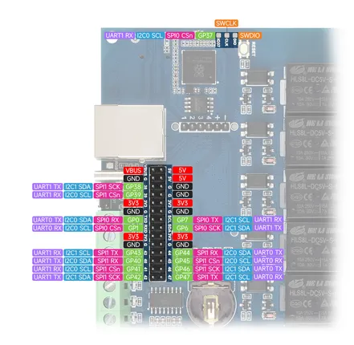
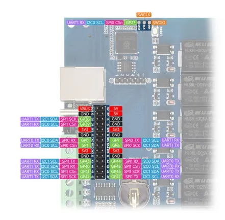

# RP2350-ETH-8DI-8RO

**Waveshare** · RP2350

Revision: Not identified

Coverage: Pinout image collected

[Browse all manufacturers](../../../../BROWSE.md) · [Devices & IoT](../../../../DEVICES.md) · [Open in the browser guide](https://valleytech-black-wire-guide.pages.dev/?board=waveshare-rp2350-rp2350-eth-8di-8ro)

## Datasheets and original documentation

Board datasheet: **not yet recorded**. Visual reference: **available**.

[Manufacturer source (recorded link)](https://www.waveshare.com/rp2350-eth-8di-8ro.htm)

A chip datasheet, schematic and board datasheet have different scopes. Match the exact hardware revision.

[Documentation coverage and remaining gaps](../../../../DOCUMENTATION.md)

## Pinout

**pinout image** · Reviewed source · JPG

[Open original reference](../../../../library/media/1e27cdb93ce58875daa47811da25c04b1e16babdd32e3262adb4d293fc9dde62.jpg)

**Credit and rights:** Not recorded; retain original attribution. Source/manufacturer: Waveshare.

[Source 1](https://www.waveshare.com/img/devkit/accBoard/RP2350-ETH-8DI-8RO/RP2350-ETH-8DI-8RO-details-inter.jpg) · [Source 2](https://www.waveshare.com/rp2350-eth-8di-8ro.htm)

Image revision: Not identified

SHA-256: `1e27cdb93ce58875daa47811da25c04b1e16babdd32e3262adb4d293fc9dde62`

## Pinout

**pinout image** · Reviewed source · JPG

[Open original reference](../../../../library/media/c7ee91d1041d875b008ace3c468e3385b010cad51cbcefa3e4b2541c0d0c1743.jpg)

**Credit and rights:** Not recorded; retain original attribution. Source/manufacturer: Waveshare.

[Source 1](https://www.waveshare.com/w/upload/f/fd/700px-RP2350-ETH-8DI-8RO-details-inter.jpg) · [Source 2](https://www.waveshare.com/wiki/RP2350-ETH-8DI-8RO)

Image revision: Not identified

SHA-256: `c7ee91d1041d875b008ace3c468e3385b010cad51cbcefa3e4b2541c0d0c1743`

Pin assignments have not been independently electrically verified. Check board revision before wiring.
