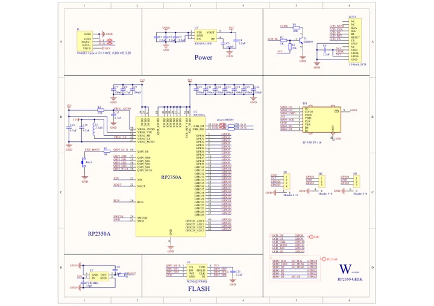

# RP2350-GEEK

**Waveshare** · RP2350

Revision: Not identified

Coverage: Manufacturer references reviewed by scope; independent electrical and all-connector review pending

[Browse all manufacturers](../../../../BROWSE.md) · [Devices & IoT](../../../../DEVICES.md) · [Open in the browser guide](https://valleytech-black-wire-guide.pages.dev/?board=waveshare-rp2350-rp2350-geek)

## Datasheets and original documentation

Board datasheet: **not yet recorded**. Visual reference: **available**.

[Manufacturer hardware documentation](https://www.waveshare.com/wiki/RP2350-GEEK)

- **schematic / board**: [RP2350-GEEK Schematic diagram](https://files.waveshare.com/wiki/RP2350-GEEK/RP2350-GEEK.pdf) · [saved document](../../../../library/media/33788e348a0915296df0e74a5630b4abf56fea0ec37eb9eafd1f65622348da2c.pdf)
- **hardware-guide / board**: [Manufacturer pin and hardware documentation](https://www.waveshare.com/wiki/RP2350-GEEK) · online

A chip datasheet, schematic and board datasheet have different scopes. Match the exact hardware revision.

[Documentation coverage and remaining gaps](../../../../DOCUMENTATION.md)

## RP2350-GEEK Schematic diagram

**original reference PDF** · Source identity and visual scope inspected; PDF review covers first-page preview. Independent electrical and all-connector completeness review pending. · PDF

[Open original reference](../../../../library/media/33788e348a0915296df0e74a5630b4abf56fea0ec37eb9eafd1f65622348da2c.pdf)

**Credit and rights:** Manufacturer artwork; reuse and print rights not established. Inclusion does not relicense the original.. Source/manufacturer: Waveshare.

[Source 1](https://files.waveshare.com/wiki/RP2350-GEEK/RP2350-GEEK.pdf) · [Source 2](https://www.waveshare.com/wiki/RP2350-GEEK)

Manufacturer source retained unchanged. Source identity and visual scope inspected; PDF review covers first-page preview. Independent electrical and all-connector completeness review pending.

Image revision: As supplied in the original; match exact board revision

SHA-256: `33788e348a0915296df0e74a5630b4abf56fea0ec37eb9eafd1f65622348da2c`

Pin assignments have not been independently electrically verified. Check board revision before wiring.
