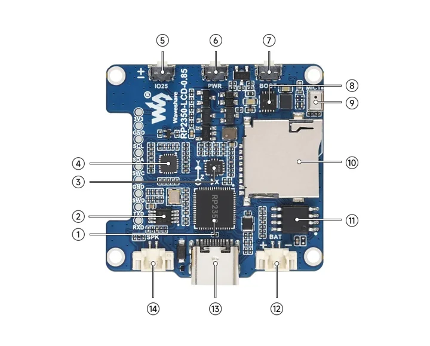
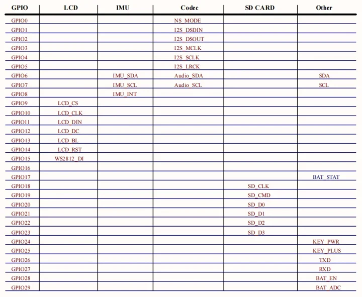
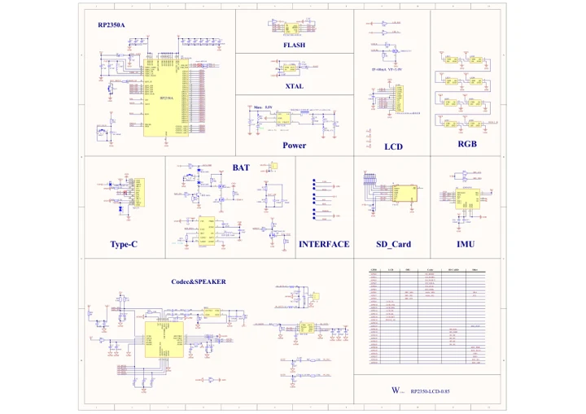

# RP2350-LCD-0.85

**Waveshare** · RP2350

Revision: Not identified

Coverage: Manufacturer references reviewed by scope; independent electrical and all-connector review pending

[Browse all manufacturers](../../../../BROWSE.md) · [Devices & IoT](../../../../DEVICES.md) · [Open in the browser guide](https://valleytech-black-wire-guide.pages.dev/?board=waveshare-rp2350-rp2350-lcd-0-85)

## Datasheets and original documentation

Board datasheet: **not yet recorded**. Visual reference: **available**.

[Manufacturer hardware documentation](https://docs.waveshare.com/RP2350-LCD-0.85)

- **schematic / board**: [RP2350-LCD-0.85 Schematic Diagram](https://files.waveshare.com/wiki/RP2350-LCD-0.85/RP2350-LCD-0.85_Schematic.pdf) · [saved document](../../../../library/media/64b741f490120c624105d4d546d372d0fea94fc4d1667f8b10037b31394d0c21.pdf)
- **hardware-guide / board**: [Manufacturer pin and hardware documentation](https://docs.waveshare.com/RP2350-LCD-0.85) · online

A chip datasheet, schematic and board datasheet have different scopes. Match the exact hardware revision.

[Documentation coverage and remaining gaps](../../../../DOCUMENTATION.md)

## Onboard Resources ​

**board labeling image** · Source identity and visual scope inspected; PDF review covers first-page preview. Independent electrical and all-connector completeness review pending. · WEBP

[Open original reference](../../../../library/media/748687fc8863747e627bcbc4a0f10f78899fe030c7c0c77babaa51c2bfc5ccb2.webp)

**Credit and rights:** Manufacturer artwork; reuse and print rights not established. Inclusion does not relicense the original.. Source/manufacturer: Waveshare.

[Source 1](https://docs.waveshare.com/assets/images/RP2350-LCD-0.85-details-intro-358ef5a9d7f838fe110b3228c4ff0c8a.webp) · [Source 2](https://docs.waveshare.com/RP2350-LCD-0.85)

Manufacturer source retained unchanged. Source identity and visual scope inspected; PDF review covers first-page preview. Independent electrical and all-connector completeness review pending. See the linked manufacturer page for the numbered component legend. This is not a complete physical pinout.

Image revision: As supplied in the original; match exact board revision

SHA-256: `748687fc8863747e627bcbc4a0f10f78899fe030c7c0c77babaa51c2bfc5ccb2`

## Interface Introduction ​

**pin function reference** · Source identity and visual scope inspected; PDF review covers first-page preview. Independent electrical and all-connector completeness review pending. · WEBP

[Open original reference](../../../../library/media/e5564c98fefd3a5bb36e03ca067fa062aa6fe6097cf31ec65504aa9ded93791c.webp)

**Credit and rights:** Manufacturer artwork; reuse and print rights not established. Inclusion does not relicense the original.. Source/manufacturer: Waveshare.

[Source 1](https://docs.waveshare.com/assets/images/RP2350-LCD-0.85-details-pin-number-7200d39c45d0c6ac5f12afb1f9847382.webp) · [Source 2](https://docs.waveshare.com/RP2350-LCD-0.85)

Manufacturer source retained unchanged. Source identity and visual scope inspected; PDF review covers first-page preview. Independent electrical and all-connector completeness review pending.

Image revision: As supplied in the original; match exact board revision

SHA-256: `e5564c98fefd3a5bb36e03ca067fa062aa6fe6097cf31ec65504aa9ded93791c`

## RP2350-LCD-0.85 Schematic Diagram

**original reference PDF** · Source identity and visual scope inspected; PDF review covers first-page preview. Independent electrical and all-connector completeness review pending. · PDF

[Open original reference](../../../../library/media/64b741f490120c624105d4d546d372d0fea94fc4d1667f8b10037b31394d0c21.pdf)

**Credit and rights:** Manufacturer artwork; reuse and print rights not established. Inclusion does not relicense the original.. Source/manufacturer: Waveshare.

[Source 1](https://files.waveshare.com/wiki/RP2350-LCD-0.85/RP2350-LCD-0.85_Schematic.pdf) · [Source 2](https://docs.waveshare.com/RP2350-LCD-0.85/Resources-And-Documents)

Manufacturer source retained unchanged. Source identity and visual scope inspected; PDF review covers first-page preview. Independent electrical and all-connector completeness review pending.

Image revision: As supplied in the original; match exact board revision

SHA-256: `64b741f490120c624105d4d546d372d0fea94fc4d1667f8b10037b31394d0c21`

Pin assignments have not been independently electrically verified. Check board revision before wiring.
