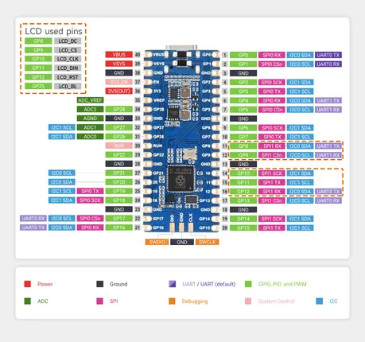

# RP2350-LCD-0.96

**Waveshare** · RP2350

Revision: Not identified  
Coverage: Pinout image collected

[Browse all manufacturers](../../../../BROWSE.md) · [Desktop app](https://github.com/valleytechsolutions/black-wire-desktop)

## Pinout

**pinout image** · Reviewed source · JPG

[Open original reference](../../../../library/media/7cdc118053984bf547f3a2f9dc200d421802ad2049983b25fdea8a434ff2f935.jpg)

**Credit and rights:** Not recorded; retain original attribution. Source/manufacturer: Waveshare.

[Source 1](https://www.waveshare.com/w/upload/0/09/RP2350-LCD-0.96-details-inter.jpg) · [Source 2](https://www.waveshare.com/wiki/RP2350-LCD-0.96) · [Source 3](https://www.waveshare.com/rp2350-lcd-0.96.htm)

SHA-256: `7cdc118053984bf547f3a2f9dc200d421802ad2049983b25fdea8a434ff2f935`

Pin assignments have not been independently electrically verified. Check board revision before wiring.
