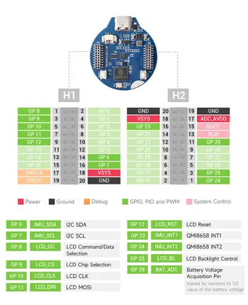
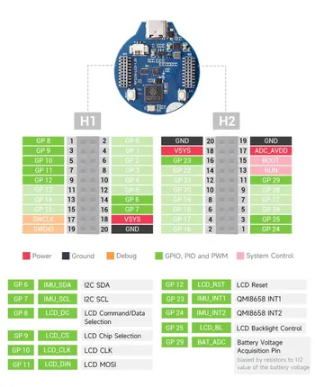

# RP2350-LCD-1.28

**Waveshare** · RP2350

Revision: Not identified  
Coverage: Pinout image collected

[Browse all manufacturers](../../../../BROWSE.md) · [Desktop app](https://github.com/valleytechsolutions/black-wire-desktop)

## Pinout

**pinout image** · Reviewed source · JPG

[Open original reference](../../../../library/media/fd8a2b96571ab4caf6932b86f45603ec4e5ba25bddcd8c36b8fb4117123ef84a.jpg)

**Credit and rights:** Not recorded; retain original attribution. Source/manufacturer: Waveshare.

[Source 1](https://www.waveshare.com/img/devkit/RP2350-LCD-1.28/RP2350-LCD-1.28-details-5.jpg) · [Source 2](https://www.waveshare.com/rp2350-lcd-1.28.htm)

SHA-256: `fd8a2b96571ab4caf6932b86f45603ec4e5ba25bddcd8c36b8fb4117123ef84a`

## Pinout

**pinout image** · Reviewed source · JPG

[Open original reference](../../../../library/media/103f8b37f3f9c93dcb55175443bdb12b7bf7aa773fdc40d388245085f4ca8707.jpg)

**Credit and rights:** Not recorded; retain original attribution. Source/manufacturer: Waveshare.

[Source 1](https://www.waveshare.com/w/upload/c/c5/800px-RP2350-LCD-1.28-details-5.jpg) · [Source 2](https://www.waveshare.com/wiki/RP2350-LCD-1.28)

SHA-256: `103f8b37f3f9c93dcb55175443bdb12b7bf7aa773fdc40d388245085f4ca8707`

Pin assignments have not been independently electrically verified. Check board revision before wiring.
