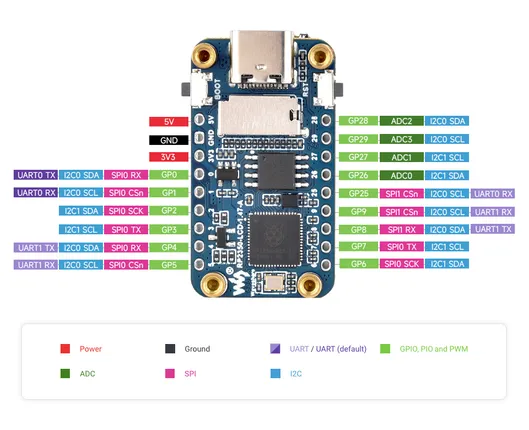
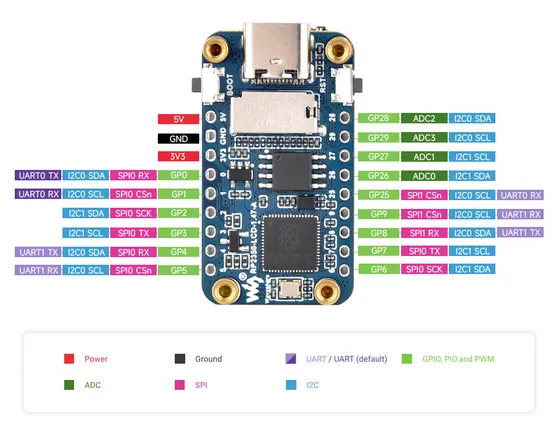

# RP2350-LCD-1.47-A

**Waveshare** · RP2350

Revision: Not identified  
Coverage: Pinout image collected

[Browse all manufacturers](../../../../BROWSE.md) · [Desktop app](https://github.com/valleytechsolutions/black-wire-desktop)

## Pinout

**pinout image** · Reviewed source · JPG

[Open original reference](../../../../library/media/403bee75fce301cc211f560ce5872c1d9623b2e16c38fee4de5491f0e2d52b75.jpg)

**Credit and rights:** Not recorded; retain original attribution. Source/manufacturer: Waveshare.

[Source 1](https://www.waveshare.com/img/devkit/RP2350-LCD-1.47-A/RP2350-LCD-1.47-A-details-inter.jpg) · [Source 2](https://www.waveshare.com/rp2350-lcd-1.47-a.htm)

SHA-256: `403bee75fce301cc211f560ce5872c1d9623b2e16c38fee4de5491f0e2d52b75`

## Pinout

**pinout image** · Reviewed source · JPG

[Open original reference](../../../../library/media/10c0696e85496040116bd00b50a4183cca1d15ac1cea3a77e45880f2f7f5f07f.jpg)

**Credit and rights:** Not recorded; retain original attribution. Source/manufacturer: Waveshare.

[Source 1](https://www.waveshare.com/w/upload/f/f3/RP2350-LCD-1.47-A-details-inter.jpg) · [Source 2](https://www.waveshare.com/wiki/RP2350-LCD-1.47-A)

SHA-256: `10c0696e85496040116bd00b50a4183cca1d15ac1cea3a77e45880f2f7f5f07f`

Pin assignments have not been independently electrically verified. Check board revision before wiring.
