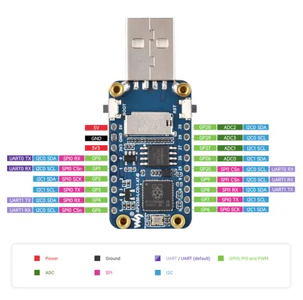

# RP2350-LCD-1.47-B

**Waveshare** · RP2350

Revision: Not identified  
Coverage: Pinout image collected

[Browse all manufacturers](../../../../BROWSE.md) · [Desktop app](https://github.com/valleytechsolutions/black-wire-desktop)

## Pinout

**pinout image** · Reviewed source · JPG

[Open original reference](../../../../library/media/de2fc4e7b22b2a0f814e6ec20fbe42dda3580bf979bb15a5f5a6e33cac6d7eab.jpg)

**Credit and rights:** Not recorded; retain original attribution. Source/manufacturer: Waveshare.

[Source 1](https://www.waveshare.com/w/upload/0/0b/RP2350-LCD-1.47-B-details-inter.jpg) · [Source 2](https://www.waveshare.com/wiki/RP2350-LCD-1.47-B)

SHA-256: `de2fc4e7b22b2a0f814e6ec20fbe42dda3580bf979bb15a5f5a6e33cac6d7eab`

Pin assignments have not been independently electrically verified. Check board revision before wiring.
