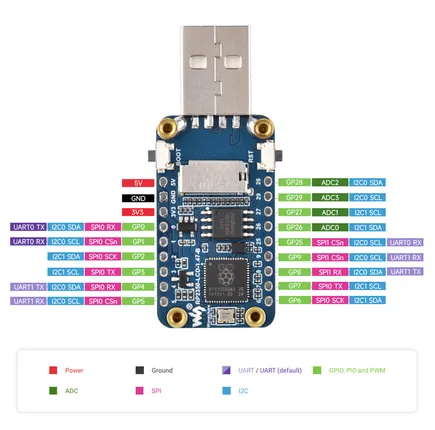

# RP2350-LCD-1.47-B

**Waveshare** · RP2350

Revision: Not identified

Coverage: Pinout image collected

[Browse all manufacturers](../../../../BROWSE.md) · [Devices & IoT](../../../../DEVICES.md) · [Open in the browser guide](https://valleytech-black-wire-guide.pages.dev/?board=waveshare-rp2350-rp2350-lcd-1-47-b)

## Datasheets and original documentation

Board datasheet: **not yet recorded**. Visual reference: **available**.

[Manufacturer source (recorded link)](https://www.waveshare.com/wiki/RP2350-LCD-1.47-B)

A chip datasheet, schematic and board datasheet have different scopes. Match the exact hardware revision.

[Documentation coverage and remaining gaps](../../../../DOCUMENTATION.md)

## Pinout

**pinout image** · Reviewed source · JPG

[Open original reference](../../../../library/media/de2fc4e7b22b2a0f814e6ec20fbe42dda3580bf979bb15a5f5a6e33cac6d7eab.jpg)

**Credit and rights:** Not recorded; retain original attribution. Source/manufacturer: Waveshare.

[Source 1](https://www.waveshare.com/w/upload/0/0b/RP2350-LCD-1.47-B-details-inter.jpg) · [Source 2](https://www.waveshare.com/wiki/RP2350-LCD-1.47-B)

Image revision: Not identified

SHA-256: `de2fc4e7b22b2a0f814e6ec20fbe42dda3580bf979bb15a5f5a6e33cac6d7eab`

Pin assignments have not been independently electrically verified. Check board revision before wiring.
