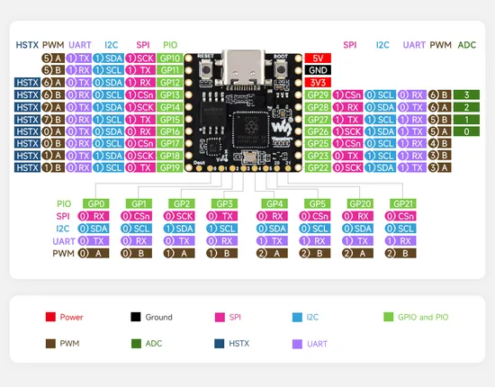
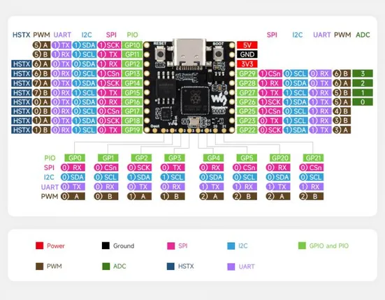

# RP2350-Matrix

**Waveshare** · RP2350

Revision: Not identified  
Coverage: Pinout image collected

[Browse all manufacturers](../../../../BROWSE.md) · [Desktop app](https://github.com/valleytechsolutions/black-wire-desktop)

## Pinout

**pinout image** · Reviewed source · JPG

[Open original reference](../../../../library/media/47571e309f1bbe0cd58410e05a1ce648e8652e5d2f2d36e269ad494ff0979bf4.jpg)

**Credit and rights:** Not recorded; retain original attribution. Source/manufacturer: Waveshare.

[Source 1](https://www.waveshare.com/img/devkit/RP2350-Matrix/RP2350-Matrix-details-inter.jpg) · [Source 2](https://www.waveshare.com/rp2350-matrix.htm)

SHA-256: `47571e309f1bbe0cd58410e05a1ce648e8652e5d2f2d36e269ad494ff0979bf4`

## Pinout

**pinout image** · Reviewed source · JPG

[Open original reference](../../../../library/media/d941b6c4103e76cd75d482586e0770728bc04d0e0260379eeecb191b006a57e3.jpg)

**Credit and rights:** Not recorded; retain original attribution. Source/manufacturer: Waveshare.

[Source 1](https://www.waveshare.com/w/upload/2/27/680px-RP2350-Matrix-details-inter.jpg) · [Source 2](https://www.waveshare.com/wiki/RP2350-Matrix)

SHA-256: `d941b6c4103e76cd75d482586e0770728bc04d0e0260379eeecb191b006a57e3`

Pin assignments have not been independently electrically verified. Check board revision before wiring.
