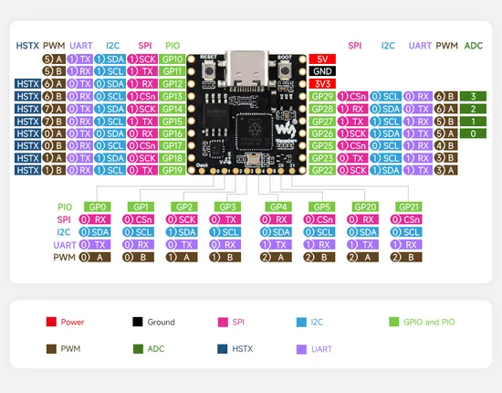
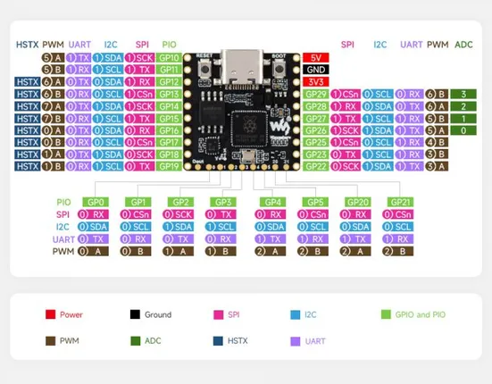

# RP2350-Matrix

**Waveshare** · RP2350

Revision: Not identified

Coverage: Pinout image collected

[Browse all manufacturers](../../../../BROWSE.md) · [Devices & IoT](../../../../DEVICES.md) · [Open in the browser guide](https://valleytech-black-wire-guide.pages.dev/?board=waveshare-rp2350-rp2350-matrix)

## Datasheets and original documentation

Board datasheet: **not yet recorded**. Visual reference: **available**.

[Manufacturer source (recorded link)](https://www.waveshare.com/rp2350-matrix.htm)

A chip datasheet, schematic and board datasheet have different scopes. Match the exact hardware revision.

[Documentation coverage and remaining gaps](../../../../DOCUMENTATION.md)

## Pinout

**pinout image** · Reviewed source · JPG

[Open original reference](../../../../library/media/47571e309f1bbe0cd58410e05a1ce648e8652e5d2f2d36e269ad494ff0979bf4.jpg)

**Credit and rights:** Not recorded; retain original attribution. Source/manufacturer: Waveshare.

[Source 1](https://www.waveshare.com/img/devkit/RP2350-Matrix/RP2350-Matrix-details-inter.jpg) · [Source 2](https://www.waveshare.com/rp2350-matrix.htm)

Image revision: Not identified

SHA-256: `47571e309f1bbe0cd58410e05a1ce648e8652e5d2f2d36e269ad494ff0979bf4`

## Pinout

**pinout image** · Reviewed source · JPG

[Open original reference](../../../../library/media/d941b6c4103e76cd75d482586e0770728bc04d0e0260379eeecb191b006a57e3.jpg)

**Credit and rights:** Not recorded; retain original attribution. Source/manufacturer: Waveshare.

[Source 1](https://www.waveshare.com/w/upload/2/27/680px-RP2350-Matrix-details-inter.jpg) · [Source 2](https://www.waveshare.com/wiki/RP2350-Matrix)

Image revision: Not identified

SHA-256: `d941b6c4103e76cd75d482586e0770728bc04d0e0260379eeecb191b006a57e3`

Pin assignments have not been independently electrically verified. Check board revision before wiring.
