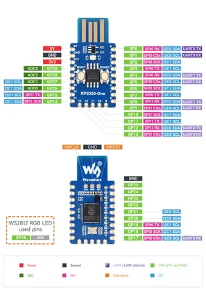

# RP2350-One

**Waveshare** · RP2350

Revision: Not identified  
Coverage: Pinout image collected

[Browse all manufacturers](../../../../BROWSE.md) · [Desktop app](https://github.com/valleytechsolutions/black-wire-desktop)

## Pinout

**pinout image** · Reviewed source · JPG

[Open original reference](../../../../library/media/983781841ae301d90d3804809a4e5efe0d8c31e625ada5677995696c8f8e0952.jpg)

**Credit and rights:** Not recorded; retain original attribution. Source/manufacturer: Waveshare.

[Source 1](https://www.waveshare.com/w/upload/7/7b/RP2350-One-details-9.jpg) · [Source 2](https://www.waveshare.com/wiki/RP2350-One) · [Source 3](https://www.waveshare.com/rp2350-one.htm)

SHA-256: `983781841ae301d90d3804809a4e5efe0d8c31e625ada5677995696c8f8e0952`

Pin assignments have not been independently electrically verified. Check board revision before wiring.
