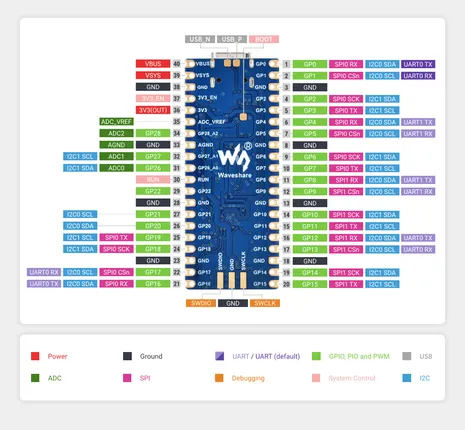
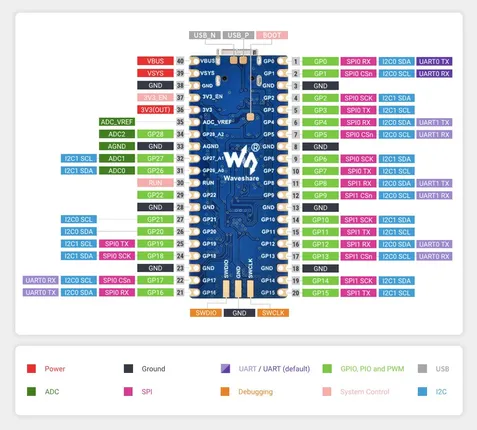

# RP2350-Plus

**Waveshare** · RP2350

Revision: Not identified  
Coverage: Pinout image collected

[Browse all manufacturers](../../../../BROWSE.md) · [Desktop app](https://github.com/valleytechsolutions/black-wire-desktop)

## Pinout

**pinout image** · Reviewed source · JPG

[Open original reference](../../../../library/media/160cd44429d53144f2e06b56bae1404621acb628a794a8a06f0457faa537f038.jpg)

**Credit and rights:** Not recorded; retain original attribution. Source/manufacturer: Waveshare.

[Source 1](https://www.waveshare.com/img/devkit/RP2350-Plus/RP2350-Plus-details-inter.jpg) · [Source 2](https://www.waveshare.com/rp2350-plus.htm)

SHA-256: `160cd44429d53144f2e06b56bae1404621acb628a794a8a06f0457faa537f038`

## Pinout

**pinout image** · Reviewed source · JPG

[Open original reference](../../../../library/media/9245335f02ed68c0db685975d87bde73b5d6a38a0a5d69d4681d7db14e55711c.jpg)

**Credit and rights:** Not recorded; retain original attribution. Source/manufacturer: Waveshare.

[Source 1](https://www.waveshare.com/w/upload/3/3c/680px-RP2350-Plus-details-inter.jpg) · [Source 2](https://www.waveshare.com/wiki/RP2350-Plus)

SHA-256: `9245335f02ed68c0db685975d87bde73b5d6a38a0a5d69d4681d7db14e55711c`

Pin assignments have not been independently electrically verified. Check board revision before wiring.
