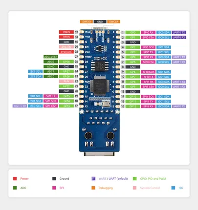

# RP2350-POE-ETH

**Waveshare** · RP2350

Revision: Not identified  
Coverage: Pinout image collected

[Browse all manufacturers](../../../../BROWSE.md) · [Desktop app](https://github.com/valleytechsolutions/black-wire-desktop)

## Pinout

**pinout image** · Reviewed source · JPG

[Open original reference](../../../../library/media/d87155f67b95d1576cf1147f8b510f373f0fa60f68e158c5ce16df5bcf336367.jpg)

**Credit and rights:** Not recorded; retain original attribution. Source/manufacturer: Waveshare.

[Source 1](https://www.waveshare.com/img/devkit/RP2350-POE-ETH/RP2350-POE-ETH-details-inter.jpg?v=260723) · [Source 2](https://www.waveshare.com/rp2350-poe-eth.htm)

SHA-256: `d87155f67b95d1576cf1147f8b510f373f0fa60f68e158c5ce16df5bcf336367`

## Pinout

**pinout image** · Reviewed source · WEBP

[Open original reference](../../../../library/media/acbdc739384d3d85057b12115cba4e6de52e8d0d6cc8a0098744bb99443afdec.webp)

**Credit and rights:** Not recorded; retain original attribution. Source/manufacturer: Waveshare.

[Source 1](https://docs.waveshare.com/assets/images/RP2350-POE-ETH-details-inter-b66631cc4e3b83483aae52d1505679b0.webp) · [Source 2](https://docs.waveshare.com/RP2350-POE-ETH)

SHA-256: `acbdc739384d3d85057b12115cba4e6de52e8d0d6cc8a0098744bb99443afdec`

Pin assignments have not been independently electrically verified. Check board revision before wiring.
