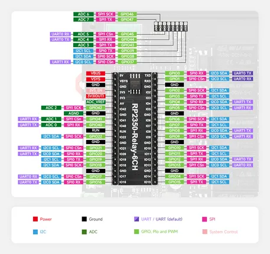

# RP2350-Relay-6CH

**Waveshare** · RP2350

Revision: Not identified  
Coverage: Pinout image collected

[Browse all manufacturers](../../../../BROWSE.md) · [Desktop app](https://github.com/valleytechsolutions/black-wire-desktop)

## Pinout

**pinout image** · Reviewed source · JPG

[Open original reference](../../../../library/media/a58bd830e3f999d1cb685979a87fb82cf3ce4e1cbe05ca54f2f6711e6200b756.jpg)

**Credit and rights:** Not recorded; retain original attribution. Source/manufacturer: Waveshare.

[Source 1](https://www.waveshare.com/img/devkit/accBoard/RP2350-Relay-6CH/RP2350-Relay-6CH-details-inter.jpg) · [Source 2](https://www.waveshare.com/rp2350-relay-6ch.htm)

SHA-256: `a58bd830e3f999d1cb685979a87fb82cf3ce4e1cbe05ca54f2f6711e6200b756`

## Pinout

**pinout image** · Reviewed source · JPG

[Open original reference](../../../../library/media/ce60cbf7c6a3635fb3a4344bb18d9caeeecf4095731389dba10e22bb42aa5159.jpg)

**Credit and rights:** Not recorded; retain original attribution. Source/manufacturer: Waveshare.

[Source 1](https://www.waveshare.com/w/upload/f/f5/700px-RP2350-Relay-6CH-details-inter_%281%29.jpg) · [Source 2](https://www.waveshare.com/wiki/RP2350-Relay-6CH)

SHA-256: `ce60cbf7c6a3635fb3a4344bb18d9caeeecf4095731389dba10e22bb42aa5159`

Pin assignments have not been independently electrically verified. Check board revision before wiring.
