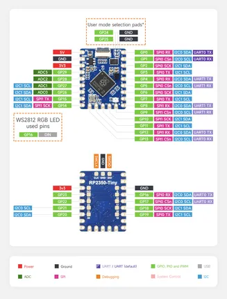

# RP2350-Tiny

**Waveshare** · RP2350

Revision: Not identified  
Coverage: Pinout image collected

[Browse all manufacturers](../../../../BROWSE.md) · [Desktop app](https://github.com/valleytechsolutions/black-wire-desktop)

## Pinout

**pinout image** · Reviewed source · JPG

[Open original reference](../../../../library/media/72c5d94485588761dc61a08ace8a78525f87a30c4039dd8bc7cf7bfea0f2812f.jpg)

**Credit and rights:** Not recorded; retain original attribution. Source/manufacturer: Waveshare.

[Source 1](https://www.waveshare.com/w/upload/8/80/RP2350-Tiny-details-9.jpg) · [Source 2](https://www.waveshare.com/wiki/RP2350-Tiny) · [Source 3](https://www.waveshare.com/rp2350-tiny.htm)

SHA-256: `72c5d94485588761dc61a08ace8a78525f87a30c4039dd8bc7cf7bfea0f2812f`

Pin assignments have not been independently electrically verified. Check board revision before wiring.
